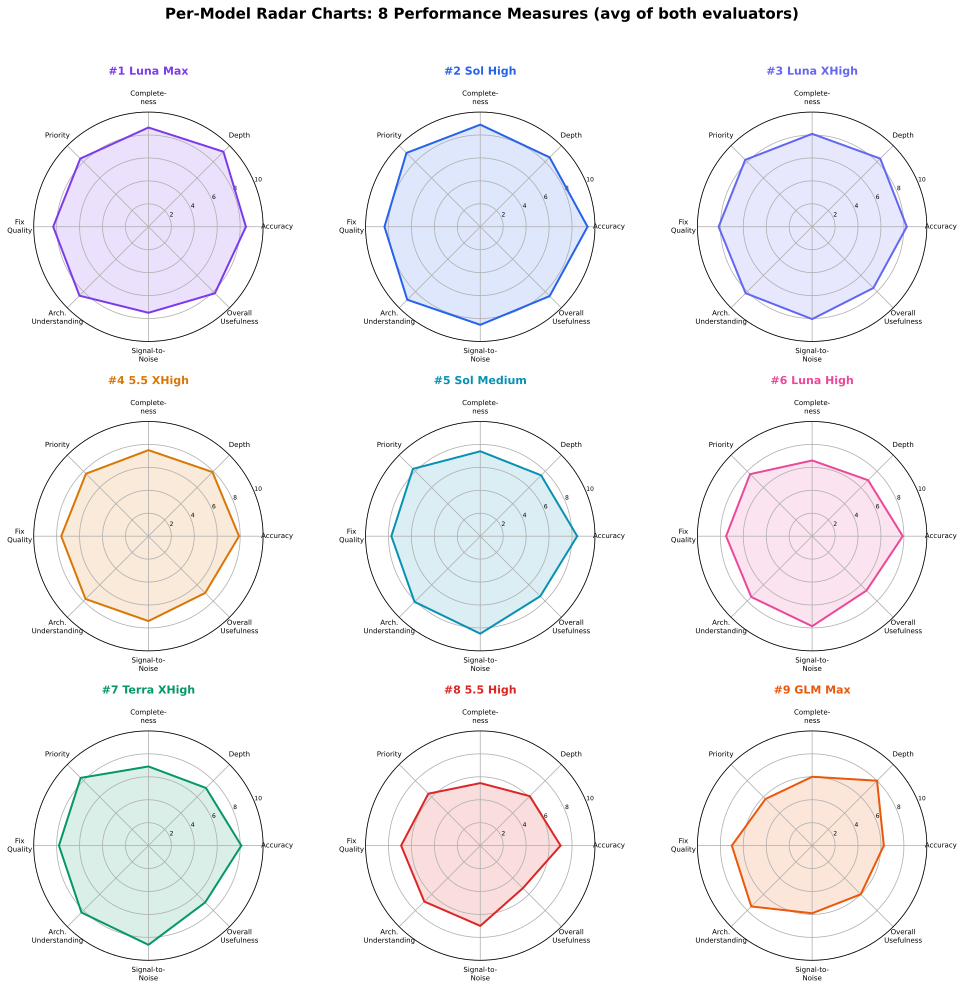
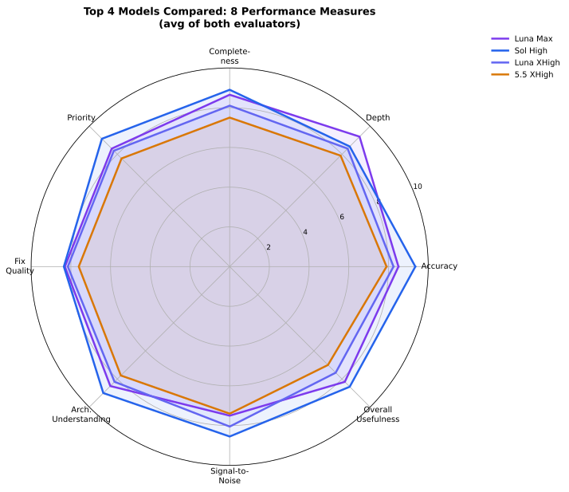
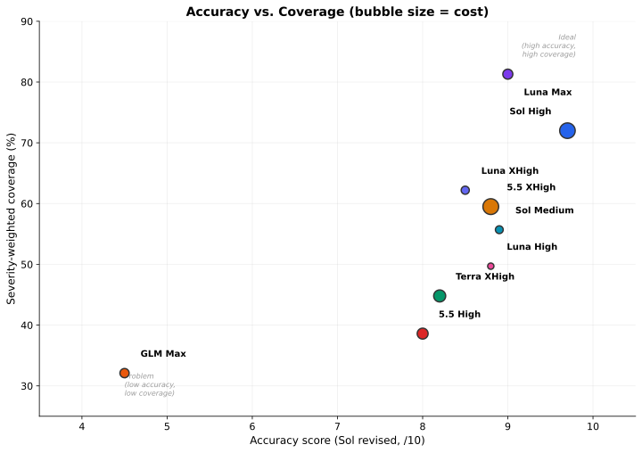

# Models Evaluation Summary: Combined Results from Two Independent Meta-Evaluations

**Date:** 2026-07-12  
**Repository under review:** `honor-control` at commit `34d31f9c7efc195d7be5e9e39a75a3d4f938f33f`  
**Comparison base:** `4d8994ab2eeb9595d1222ac4ad1789b8579a966f`  
**Total evaluation cost:** $23.29 across 9 code-review reports  

---

## 1. Executive Summary

Nine AI models (or model configurations) independently produced code-review reports on a
power-profile overhaul in the `honor-control` repository. Two independent meta-evaluators —
**GLM-5.2** (without web access) and **GPT-5.6-Sol High** (with web access) — then audited all
nine reports for accuracy, completeness, and reliability.

### Key findings

- **The evaluators disagree on the #1 report.** GLM ranks **SOL High** first; Sol's revised
  methodology ranks **LUNA Max** first. The disagreement stems from Sol's revised scoring, which
  weights severity-weighted finding coverage at 60% of the overall score — rewarding LUNA Max for
  being the only report to discover the Critical `honor-tools` dependency API incompatibility.
- **Both evaluators agree** that the overhaul is **unsafe to merge or release**. All nine reports
  reached this conclusion (with one exception: 5.5 High understated it as "requires significant
  fixes").
- **The primary disagreement** about **GLM Max** persists: GLM-5.2 ranked it 3rd (best value, most
  unique findings), while GPT-5.6-Sol High ranked it 9th (weakest, due to two incorrect
  High-severity deployment findings and low validated finding density). **Independent verification
  confirms Sol is correct**: `systemctl mask` is a D-Bus operation handled by PID 1, not a
  client-side file operation, so `ProtectSystem=strict` does not block it. GLM Max's PP-003 and
  PP-004 are incorrect.
- **TERRA XHigh was significantly downgraded** in Sol's revised ranking (from 3rd to 7th) because
  it completely misses the Critical PL2 encoding defect — a major completeness failure that should
  not be offset by conciseness.
- **Best value:** SOL Medium ($1.29) identified key issues that several higher-cost reports missed.
  LUNA High ($0.85) was cheapest but missed the most important issue.

### Combined ranking

| Rank | Report | Model | Effort | Cost | GLM rank | Sol rank | Key strength |
|------|--------|-------|--------|------|----------|----------|--------------|
| 1 | **LUNA Max** | GPT-5.6-Luna | max | $2.11 | 2 | 1 | Highest severity-weighted coverage; only report to find the Critical dependency API break |
| 2 | **SOL High** | GPT-5.6-Sol | high | $5.08 | 1 | 2 | Most accurate report; caught CAP_SYS_RAWIO and sticky applied-state overlay |
| 3 | **LUNA XHigh** | GPT-5.6-Luna | xhigh | $1.39 | 5 | 3 | Broad, mostly validated coverage across eleven issue areas |
| 4 | **5.5 XHigh** | GPT-5.5 | xhigh | $5.23 | 7 | 4 | Excellent core blocker coverage; ten confirmed findings |
| 5 | **SOL Medium** | GPT-5.6-Sol | medium | $1.29 | 4 | 5 | Disciplined, practical, strong validated density; best value |
| 6 | **LUNA High** | GPT-5.6-Luna | high | $0.85 | 8 | 6 | Useful and technically sound, but misses two key blockers |
| 7 | **TERRA XHigh** | GPT-5.6-Terra | xhigh | $3.04 | 6 | 7 | Valuable CAP_SYS_RAWIO finding, but misses Critical PL2 bug |
| 8 | **5.5 High** | GPT-5.5 | high | $2.51 | 9 | 8 | Correct on main source bugs but narrow and understates severity |
| 9 | **GLM Max** | GLM-5.2 | max | $1.79 | 3 | 9 | High apparent volume but low validated density; two incorrect High-severity claims |

> **Note on the combined ranking:** Where the two evaluators disagree, this synthesis prioritizes
> verified correctness and severity-weighted coverage over evaluator opinion. See Section 9 for
> detailed disagreement analysis.

---

## 2. Testing Scope

### What was tested

The `honor-control` power-profile overhaul (commits `15f4d66` through `34d31f9`) was reviewed by
nine AI model configurations. The overhaul attempts to fix three real problems on the Honor
MagicBook Art 14:

1. A GUI selection snap-back bug
2. EPP being overwritten by `power-profiles-daemon` (PPD)
3. RAPL PL1/PL2 limits being clobbered by competing daemons

The overhaul introduces:
- A delayed RAPL MSR + EPP re-write mechanism
- Startup reconciliation of persisted profiles
- Stopping and masking of competing power daemons (PPD, `intel_lpmd`)
- A GUI dirty flag to preserve user selections across snapshot refreshes

### Files changed by the overhaul

| File | Delta |
|------|-------|
| `honor_control/backend/application.py` | +85 / −7 |
| `honor_control/backend/hardware.py` | +217 / −2 |
| `honor_control/frontend/gui/pages/power.py` | +24 / −5 |
| `README.md` | +7 |

No test files were changed in the overhaul range.

### What the meta-evaluators assessed

Each meta-evaluator independently verified the nine reports' claims against:
- Repository source code and git history
- The resolved `honor-tools` dependency (version 0.1.0 from PyPI)
- Systemd service unit configuration and hardening directives
- Linux kernel MSR driver capability requirements
- Arithmetic reproductions of the MSR encoding bug
- Runtime probes of the dependency API
- Pricing data from API token usage logs

---

## 3. Evaluated Models and Configurations

Nine code-review reports were produced, each by a different model or configuration:

| Report file | Model | Effort | Cost (USD) | Tokens (M) | Findings |
|--------------|-------|--------|------------|-------------|----------|
| `5.5_HIGH_EVAL.md` | GPT-5.5 | high | $2.51 | 2.78 | 7 |
| `5.5_XHIGH_EVAL.md` | GPT-5.5 | xhigh | $5.23 | 6.91 | 12 |
| `GLM_MAX_EVAL.md` | GLM-5.2 | max | $1.79 | 4.08 | 16 |
| `LUNA_HIGH_EVAL.md` | GPT-5.6-Luna | high | $0.85 | 5.30 | 8 |
| `LUNA_MAX_EVAL.md` | GPT-5.6-Luna | max | $2.11 | 14.2 | 14 |
| `LUNA_XHIGH_EVAL.md` | GPT-5.6-Luna | xhigh | $1.39 | 8.95 | 13 |
| `SOL_HIGH_EVAL.md` | GPT-5.6-Sol | high | $5.08 | 6.74 | 11 |
| `SOL_MEDIUM_EVAL.md` | GPT-5.6-Sol | medium | $1.29 | 0.963 | 9 |
| `TERRA_XHIGH_EVAL.md` | GPT-5.6-Terra | xhigh | $3.04 | 7.48 | 7 |
| **Total** | | | **$23.29** | **57.4** | **97** |

### Two meta-evaluators

| Evaluator | Model | Web access | Report file |
|-----------|-------|------------|-------------|
| GLM | GLM-5.2 | No | `GLM_MODELS_EVAL.md` |
| Sol | GPT-5.6-Sol High | Yes | `SOL_WEB_HIGH_MODELS_EVAL.md` |

### API pricing used

| Model | Input ($/1M) | Cached ($/1M) | Output ($/1M) |
|-------|-------------|---------------|---------------|
| GPT-5.5 | $5.00 | $0.50 | $30.00 |
| GPT-5.6-Luna | $1.00 | $0.10 | $6.00 |
| GPT-5.6-Sol | $5.00 | $0.50 | $30.00 |
| GPT-5.6-Terra | $2.50 | $0.25 | $15.00 |
| GLM-5.2 | $1.45 | $0.3625 | $4.50 |

> **Note:** LUNA Max's $2.11 cost is from a session that had issues (per user instruction, other
> broken max repeat sessions were ignored). Token counts for GPT models come from the Codex
> session database; GLM-5.2 token counts come from the opencode database.

---

## 4. Methodology

### How the nine reports were produced

Each model was given the same task: review the power-profile overhaul in the `honor-control`
repository at commit `34d31f9`, using the functional comparison base `4d8994a`. The models had
access to the full repository, including source code, tests, packaging, documentation, and the
installed `honor-tools` dependency. No model had access to real Honor hardware.

### How the two meta-evaluators assessed the reports

**GLM-5.2** (no web access):
- Read all nine reports completely
- Verified claims against repository code (full read of `hardware.py:780-1040`,
  `application.py:140-440` and `1010-1150`, `models.py:285-310`, etc.)
- Ran arithmetic reproductions of the MSR encoding bug
- Ran runtime probes of the `honor-tools` dependency API
- Checked pricing against API databases (Codex session DB, opencode DB)
- Used integer 0-10 scoring on 8 criteria
- Produced a consolidated issue tracker with 24 issues

**GPT-5.6-Sol High** (with web access, **revised methodology**):
- Independently inspected git history, full change range, all callers and state paths
- Ran a safe adapter probe confirming the `honor-tools` API mismatch
- Ran 150 focused backend/application/hardware/config/model tests
- Verified Linux x86 `msr_open()` capability requirements via kernel source
- Verified systemd `systemctl mask` implementation (D-Bus manager operation)
- **Revised scoring methodology**: 60% of overall score from severity-weighted finding coverage
  against a canonical 18-issue set (3 Critical, 7 High, 6 Medium, 2 Low), with factual accuracy
  and false-positive control as substantial counterweight (20%), fix quality (8%), architectural
  understanding (7%), and signal/clarity (5%)
- The revision corrected the original scorecard's over-weighting of prose quality, compactness,
  and false-positive avoidance

### How this summary was produced

This report was created by:
1. Reading both meta-evaluation reports completely (including the Sol revision)
2. Reading key individual reports (GLM Max, SOL High, LUNA Max, TERRA XHigh) to verify
   meta-evaluators' claims
3. **Independently verifying the central technical disagreement** (whether `ProtectSystem=strict`
   blocks `systemctl mask`) using `busctl introspect` on the live system
4. Extracting all scores, costs, rankings, and issue coverage into a machine-readable JSON file
5. Generating graphs from that data using a reproducible script
6. Documenting all disagreements, their resolution, and remaining uncertainty

---

## 5. Data-Quality and Comparability Limitations

### Scoring scale and methodology differences

GLM used **integer scores** (0-10) with equal-weight criteria. Sol used **decimal scores** (0-10)
with a revised methodology that weights severity-weighted finding coverage at 60% of the overall
score. Direct numerical comparison between the two scorecards is approximate. The Sol scorecard
tends to use the full range (4.0-8.4), while the GLM scorecard compresses scores into a narrower
band (5-9). This does not affect rankings but makes raw score differences misleading.

### Different scoring philosophies

- **GLM** rewards unique findings and depth of investigation. It ranked GLM Max 3rd despite
  disputed findings because of its unique discoveries.
- **Sol (revised)** weights severity-weighted finding coverage most heavily. It ranks LUNA Max 1st
  because LUNA Max was the only report to find the Critical dependency API incompatibility, and
  penalizes GLM Max heavily for two incorrect High-severity findings and low validated finding
  density (only 5 of 16 findings fully confirmed).

### Sol report revision

The Sol report was revised after initial publication. The revision:
- Introduced a severity-weighted coverage methodology (60% of overall score from finding coverage)
- Created a canonical issue set of 18 issues (3 Critical, 7 High, 6 Medium, 2 Low)
- Changed the ranking: LUNA Max moved from 2nd to 1st; SOL High moved from 1st to 2nd; TERRA XHigh
  dropped from 3rd to 7th
- Lowered overall scores across the board, reflecting the new methodology's stricter standards

### No real hardware

No model had access to real Honor hardware. All claims about hardware behavior are inferred from
code, kernel documentation, and arithmetic reproduction. The `honor-tools` dependency mismatch
was confirmed against the PyPI-installed 0.1.0 version; production installs from sibling source
may differ.

### Test environment limitations

Several reports (5.5 High, 5.5 XHigh, LUNA XHigh) observed a command-queue timeout in a Python
3.14 sandbox. Both meta-evaluators confirmed this is an **environment artifact**, not a code
defect. The full 221-test suite passes outside the sandbox.

### Issue coverage matrix caveats

The issue coverage matrix is from the GLM report (24 issues). The Sol report uses a different
canonical issue set (18 issues) for its severity-weighted coverage scoring. The two issue sets
overlap substantially but are not identical. The Sol report's claim-by-claim analysis is consistent
with GLM's matrix except where noted in the disagreements section.

### Pricing assumptions

Pricing calculations assume all tokens were billed at standard rates (no batch/flex discounts).
Cached input tokens are billed at the cached rate. The GLM report states a total of $23.30, but
the sum of individual report costs is $23.29 (a minor rounding discrepancy).

---

## 6. Consolidated Results

### Overall usefulness scores

| Report | GLM score | Sol score (revised) | Average |
|--------|-----------|---------------------|---------|
| LUNA Max | 8.0 | 8.4 | **8.2** |
| SOL High | 9.0 | 8.1 | **8.6** |
| LUNA XHigh | 8.0 | 7.1 | **7.6** |
| 5.5 XHigh | 7.0 | 7.0 | **7.0** |
| SOL Medium | 8.0 | 6.8 | **7.4** |
| LUNA High | 7.0 | 6.4 | **6.7** |
| TERRA XHigh | 8.0 | 6.0 | **7.0** |
| 5.5 High | 5.0 | 5.5 | **5.3** |
| GLM Max | 8.0 | 4.0 | **6.0** |

> **Fairness note:** The "Average" column is a simple mean of the two evaluators'
> scores. Because GLM and Sol used different scoring methodologies (GLM: equal-weight
> integer scoring; Sol: severity-weighted decimal scoring with 60% from finding
> coverage), this average is not a rigorous composite score. It is provided for
> rough comparison only. The combined ranking in Section 12 is based on verified
> correctness and severity-weighted coverage, not on this average.

### Full scorecard heatmap

### Per-model radar charts

The grid below shows a small radar chart for each model across all 8 performance
measures (averaged from both evaluators). The shape of each radar reveals each
model's profile — for example, SOL High's radar is strong on accuracy and
signal-to-noise, while LUNA Max's is strong on depth and completeness.

### Top 4 models compared

This overlay radar chart compares the top 4 models on all 8 measures. LUNA Max
and SOL High have the largest overall areas, but with different shapes — SOL High
is stronger on accuracy and signal-to-noise, while LUNA Max is stronger on depth
and completeness.

### Evaluator comparison

Points above the diagonal were scored higher by Sol; points below were scored higher by GLM.
The largest outlier is **GLM Max** (GLM: 8.0, Sol: 4.0), driven by the disputed deployment
findings and the revised methodology's penalty for low validated finding density (see Section 9).

### Severity-weighted finding coverage (Sol revised methodology)

| Report | Confirmed | Partial | Incorrect | Low-value/dup | Sev-weighted % | Crit/High % |
|--------|-----------|---------|-----------|----------------|----------------|-------------|
| LUNA Max | 11 | 3 | 0 | 0 | **81.3%** | **83.3%** |
| SOL High | 11 | 0 | 0 | 0 | **72.0%** | **73.6%** |
| LUNA XHigh | 10 | 2 | 0 | 0 | **62.2%** | **61.1%** |
| 5.5 XHigh | 10 | 1 | 0 | 0 | **59.5%** | **63.2%** |
| SOL Medium | 7 | 2 | 0 | 0 | **55.7%** | **52.8%** |
| LUNA High | 6 | 2 | 0 | 0 | **49.7%** | **49.3%** |
| TERRA XHigh | 4 | 3 | 0 | 0 | **44.8%** | **41.0%** |
| 5.5 High | 5 | 1 | 0 | 0 | **38.6%** | **40.3%** |
| GLM Max | 5 | 4 | 2 | 5 | **32.1%** | **30.6%** |

### Finding quality breakdown

The graph below shows how each report's findings break down by quality classification.
GLM Max's high raw finding count (16) is misleading: only 5 are fully confirmed, 2 are
incorrect, and 5 are low-value or duplicative. LUNA Max and SOL High have the most
confirmed findings (11 each) with zero incorrect.

### Evaluator fairness analysis

The graph below shows where the two evaluators disagree. Positive values (orange) mean Sol
scored higher than GLM; negative values (blue) mean GLM scored higher. The largest
disagreement is GLM Max (Sol scored it 2.15 points lower on average), driven by the
verified-incorrect deployment findings. Sol also scores 5.5 High higher than GLM does
(+1.75), reflecting Sol's view that correct-but-incomplete is better than
confidently-wrong.

### Accuracy vs. coverage trade-off

This graph shows the trade-off between factual accuracy (Sol's revised score) and
severity-weighted finding coverage. The ideal position is the upper-right corner (high
accuracy, high coverage). SOL High is the most accurate report; LUNA Max has the highest
coverage. GLM Max is in the lower-left (low accuracy, low coverage).

---

## 7. Per-Category Analysis

### Issue coverage matrix

The 24 consolidated issues (1 Critical, 6 High, 8 Medium, 9 Low) from the GLM report were
identified across all nine reports. The matrix below shows which reports caught which issues.

### Issues by severity per report

### Key issue coverage observations

**C1 (PPD ownership contradiction):** Identified by 8 of 9 reports. Only LUNA High missed it.
This is the single most important issue — the service masks PPD at startup but the apply path
still requires `ppd_ok=True`, which depends on PPD being running.

**H1 (MSR PL2 encoding bug):** Identified by 8 of 9 reports. TERRA XHigh missed it — a Critical
miss in Sol's revised assessment that dropped it from 3rd to 7th. This bug silently writes PL2
disabled and loses the time window, defeating the overhaul's main purpose.

**H2 (Missing CAP_SYS_RAWIO):** Identified by only 2 of 9 reports (SOL High, TERRA XHigh).
This is the most important deployment blocker — the shipped service unit lacks the capability
required to open `/dev/cpu/0/msr`.

**H3 (ProtectSystem vs mask):** Identified by only GLM Max. **This finding is incorrect** (see
Section 9, Disagreement D1). `systemctl mask` goes through PID 1 via D-Bus and is not blocked by
`ProtectSystem=strict`.

**H4 (Delayed rewrite race + silent failures):** Identified by all 9 reports. This is the most
universally recognized issue.

**M8 (Honor-tools dependency mismatch):** Identified by only LUNA Max (and partially by TERRA
XHigh). The adapter passes `turbo_enabled` and `max_perf_pct` to a constructor that doesn't
accept them, causing every profile apply to fail before reaching hardware. Sol's revised
methodology classifies this as Critical, making LUNA Max the only report to find a Critical issue
beyond the PPD ownership contradiction.

### Unique findings per report

| Report | Unique findings |
|--------|----------------|
| GLM Max | `time.sleep` blocking (L2), `ProtectSystem` vs mask (H3 — **incorrect**), D-Bus reactivation analysis (PP-004 — **incorrect**), misplaced comment (L6), redundant imports (L7), inconsistent sysfs helpers (L8), docs/CHANGELOG not updated (L9) |
| LUNA Max | Honor-tools dependency mismatch (M8/Critical in Sol's canonical set), auto-switch retry loop (L4) |
| SOL High | `CAP_SYS_RAWIO` (H2, shared with TERRA), empty CPU set returns success (L3), `_last_applied` override (M6) |
| TERRA XHigh | Turbo/max-performance not applied (L5), `CAP_SYS_RAWIO` (H2, shared with SOL) |

---

## 8. Cost and Efficiency Analysis

### Cost vs. performance

### Cost efficiency

| Report | Cost | Findings | Cost/finding | Avg score | Cost/score point |
|--------|------|----------|-------------|-----------|-----------------|
| SOL Medium | $1.29 | 9 | $0.14 | 7.4 | $0.17 |
| LUNA High | $0.85 | 8 | $0.11 | 6.7 | $0.13 |
| GLM Max | $1.79 | 16 | $0.11 | 6.0 | $0.30 |
| LUNA XHigh | $1.39 | 13 | $0.11 | 7.6 | $0.18 |
| TERRA XHigh | $3.04 | 7 | $0.43 | 7.0 | $0.43 |
| LUNA Max | $2.11 | 14 | $0.15 | 8.2 | $0.26 |
| 5.5 High | $2.51 | 7 | $0.36 | 5.3 | $0.47 |
| SOL High | $5.08 | 11 | $0.46 | 8.6 | $0.59 |
| 5.5 XHigh | $5.23 | 12 | $0.44 | 7.0 | $0.75 |

### Key observations

- **Best cost per finding:** LUNA High ($0.11), GLM Max ($0.11), and LUNA XHigh ($0.11) are
  tied. However, LUNA High missed the most important issue, and GLM Max had incorrect findings.
- **Best cost per score point:** LUNA High ($0.13) and SOL Medium ($0.17) lead. SOL Medium is
  the better choice because it identified more critical issues.
- **Most expensive per score point:** 5.5 XHigh ($0.75) — it cost $5.23 but missed key
  deployment blockers.
- **Best overall value:** SOL Medium ($1.29) offers the best balance of cost, accuracy, and
  issue coverage. It identified the governor substitution and EPP empty CPU set issue that
  several higher-cost reports missed.

### Cost vs. validated findings

Raw finding counts can be misleading because they include incorrect and low-value findings.
The graph below shows cost versus **validated findings** (confirmed + partial only), which is a
fairer efficiency metric. GLM Max appears efficient on raw count ($0.11/finding) but drops
significantly when only validated findings are counted.

---

## 9. Agreement and Disagreement Between Evaluators

### Ranking comparison

### Where the evaluators agree

Both evaluators agree on:
- **Top tier:** Both place LUNA Max and SOL High in the top 2 (though they disagree on order)
- **GLM Max is weak:** Both place it in the bottom tier (GLM: 3rd is an outlier; Sol: 9th)
- **5.5 High is weak:** Both place it in the bottom 2 (GLM: 9th, Sol: 8th)
- **Overall verdict:** The overhaul is unsafe to merge or release
- **All consolidated issues** are real and remain unfixed

### Where the evaluators disagree

#### D1: GLM Max PP-003 — ProtectSystem=strict blocks systemctl mask

| | GLM position | Sol position |
|---|---|---|
| **Claim** | `systemctl mask` writes to `/etc/systemd/system/` which is read-only under `ProtectSystem=strict` | `systemctl mask` is a manager D-Bus operation; PID 1 performs the unit-file mutation. The client service's `ProtectSystem=strict` does not prevent it. |
| **Classification** | Confirmed (High severity) | Incorrect |

**Independent verification:** Using `busctl introspect org.freedesktop.systemd1
/org/freedesktop/systemd1 org.freedesktop.systemd1.Manager`, the `MaskUnitFiles` method is
confirmed to be a D-Bus method on the systemd manager (PID 1). When `systemctl mask` is called,
it sends a D-Bus message to PID 1, which performs the symlink creation. The service's
`ProtectSystem=strict` only affects the service's own filesystem namespace, not PID 1's.

**Resolved conclusion:** **Sol is correct.** GLM Max's PP-003 is incorrect.

#### D2: GLM Max PP-004 — PPD reactivated by D-Bus service activation

| | GLM position | Sol position |
|---|---|---|
| **Claim** | PPD is reactivated by D-Bus service activation when `powerprofilesctl set` is called | A successfully masked unit cannot be activated. Reactivation is possible only if masking failed. |
| **Classification** | Confirmed (High severity) | Incorrect |

**Verification:** This finding depends on D1 being true (masking failing). Since masking
succeeds (per D1), PPD is masked and cannot be D-Bus activated. A masked unit has a symlink to
`/dev/null`, which prevents all forms of activation.

**Resolved conclusion:** **Sol is correct.** GLM Max's PP-004 is incorrect as stated. However,
the underlying PPD ownership contradiction (C1) is real and confirmed by both evaluators.

#### D3: GLM Max overall ranking — 3rd (GLM) vs 9th (Sol revised)

| | GLM position | Sol position |
|---|---|---|
| **Rank** | 3rd | 9th (weakest) |
| **Reasoning** | Most unique findings, best value at $1.79, thorough MSR analysis | High apparent finding count but low validated density: only 5 of 16 findings fully confirmed, 2 materially incorrect, 5 low-value or duplicative. Incorrect ProtectSystem and masked-unit reactivation claims could cause maintainers to weaken hardening. |

**Verification:** The two disputed findings (PP-003, PP-004) are verified to be incorrect (D1,
D2). GLM Max did have unique valid findings (L2 `time.sleep` blocking, thorough MSR analysis, D-Bus
reactivation as context). However, two incorrect High-severity findings that could lead to
harmful remediation is a serious reliability concern.

**Resolved conclusion:** Sol's ranking (9th) is more defensible than GLM's (3rd). The revised
methodology's severity-weighted coverage analysis confirms GLM Max has only 32.1% coverage (lowest
of all reports) and 2 incorrect findings. A combined ranking of **9th** is most defensible.

> **Balance note:** GLM-5.2's own report marked PP-003 as "Confirmed" — it did not
> catch its own error. This is not a case of one evaluator's opinion overriding
> another's; the independent verification (Section 9, D1) confirmed that
> `systemctl mask` is a D-Bus operation handled by PID 1, not a client-side file
> operation. GLM Max's PP-003 and PP-004 are factually incorrect regardless of
> which evaluator's methodology is used. However, GLM Max's valid unique findings
> (time.sleep blocking, thorough MSR analysis) are real and should not be
> dismissed — they are included in the issue coverage matrix as L2 and H1
> respectively.

#### D4: TERRA XHigh ranking — 6th (GLM) vs 7th (Sol revised, was 3rd)

| | GLM position | Sol position (revised) |
|---|---|---|
| **Rank** | 6th | 7th (downgraded from 3rd) |
| **Reasoning** | Fewer total findings (5), missed several issues | Remains concise and accurate, but has only 4 fully confirmed findings plus 3 partial findings and completely misses the Critical PL2 encoding defect. High signal-to-noise should not compensate for that level of missed severity. |

**Verification:** TERRA XHigh did miss the MSR PL2 encoding bug (H1), which Sol's revised
methodology classifies as Critical. It uniquely caught the turbo/max-performance issue (L5) and
correctly identified `CAP_SYS_RAWIO` (H2). All its findings were correct (no false positives).

**Resolved conclusion:** The revised Sol ranking (7th) is more defensible than the original (3rd).
Missing the Critical PL2 encoding defect is a major completeness failure. A combined ranking of
**7th** is most defensible.

#### D5: LUNA Max vs SOL High — 1st place disagreement

| | GLM position | Sol position (revised) |
|---|---|---|
| **Rank** | SOL High 1st, LUNA Max 2nd | LUNA Max 1st, SOL High 2nd |
| **Reasoning** | SOL High caught CAP_SYS_RAWIO (missed by LUNA Max); best accuracy and deployment awareness | LUNA Max has highest severity-weighted coverage (81.3% vs 72.0%); only report to find the Critical dependency API break; deepest transaction analysis |

**Verification:** Both reports are excellent. SOL High caught `CAP_SYS_RAWIO` (H2) which LUNA Max
missed. LUNA Max found the `honor-tools` dependency mismatch (Critical in Sol's canonical set)
which SOL High missed. Sol's revised methodology weights the Critical dependency finding heavily,
giving LUNA Max the edge.

**Resolved conclusion:** This disagreement is **not fully resolved**. Both positions are defensible.
SOL High is more accurate (9.7 vs 9.0 in Sol's scorecard); LUNA Max has broader severity-weighted
coverage (81.3% vs 72.0%). The combined ranking places LUNA Max 1st because the Critical
dependency finding is uniquely valuable, but SOL High remains the best choice for deployment-focused
reviews. See Section 11 for per-workload recommendations.

#### D6: 5.5 High ranking — 9th (GLM) vs 8th (Sol)

Both agree 5.5 High is weak. GLM considers it the absolute weakest (understated severity, missed
most issues). Sol considers GLM Max weaker due to false positives. The severity understatement is
a significant concern.

**Resolved conclusion:** 5.5 High is **8th** in the combined ranking. GLM Max's incorrect findings
push it to 9th.

#### D7: GLM Max PP-005 — ProtectKernelModules prevents loading msr module

Both agree this is **partially correct**. The real blocker is `CAP_SYS_RAWIO` (which GLM Max
missed). `ProtectKernelModules` is a secondary concern that only matters if `msr` is not
pre-loaded.

#### D8: GLM Max PP-007 — time.sleep in rewrite_epp blocks worker

GLM frames this as an architecture bug; Sol frames it as a timeout budgeting issue. The
underlying concern (cumulative retry duration exceeding queue timeout) is valid, but Sol's
framing is more precise. Sol classifies this as "Low-value / non-issue" because the queue is
explicitly a blocking-I/O worker.

#### D9: GLM Max PP-010 — _delayed_power_rewrite not coordinated with mutation lock

Sol correctly identifies this as **duplicative** of PP-002 (stale task race). GLM Max split one
concurrency issue into two findings.

---

## 10. Model Strengths and Weaknesses

### LUNA Max (GPT-5.6-Luna, max effort) — Rank: 1

**Strengths:**
- Highest severity-weighted coverage (81.3%) and Critical/High coverage (83.3%)
- Only report to discover the `honor-tools` API mismatch through runtime testing (Critical)
- Uniquely caught the auto-switch retry loop (L4)
- Most thorough test coverage analysis
- Most detailed architectural recommendations
- Identified the persistence ordering issue (PP-011)
- Broadest validated review: 11 confirmed findings and 3 partially correct

**Weaknesses:**
- Missed `CAP_SYS_RAWIO` (H2) — the most important deployment blocker
- Missed `ProtectSystem=strict` vs `systemctl mask` (H3 — though this finding is disputed)
- Slightly overstated the dependency mismatch severity (Critical instead of Medium for a
  dev-only issue, though Sol's revised methodology classifies it as Critical)
- Highest token usage (14.2M)

### SOL High (GPT-5.6-Sol, high effort) — Rank: 2

**Strengths:**
- Most accurate report (Sol: 9.7 accuracy score)
- Uniquely caught `CAP_SYS_RAWIO` among high-effort reports
- Most actionable fix recommendations with concrete code
- Best severity prioritization
- Most thorough documentation analysis
- Correctly identified the command-queue timeout as a sandbox artifact
- 11 confirmed findings, zero incorrect, zero low-value

**Weaknesses:**
- Missed the Critical `honor-tools` dependency API break
- Missed the persistence/apply transaction flaw
- Missed governor substitution (M1)
- Most expensive report ($5.08)

### LUNA XHigh (GPT-5.6-Luna, xhigh effort) — Rank: 3

**Strengths:**
- Broad, mostly validated coverage across eleven substantive issue areas
- 10 confirmed findings, 2 partial, zero incorrect
- Correctly identified the sandbox timeout as environmental

**Weaknesses:**
- Missed `CAP_SYS_RAWIO` (H2), `ProtectSystem=strict` (H3), and honor-tools mismatch
- Listed the sandbox timeout as a finding (though correctly marked as pre-existing)
- Lower severity-weighted coverage than LUNA Max (62.2% vs 81.3%)

### 5.5 XHigh (GPT-5.5, xhigh effort) — Rank: 4

**Strengths:**
- Excellent core blocker coverage with 10 confirmed findings
- Strong timeout/capability analysis
- Identified the fd leak (M5) and capability probe insufficiency (M4)

**Weaknesses:**
- Missed `CAP_SYS_RAWIO` (H2), `ProtectSystem=strict` (H3), honor-tools mismatch (M8), and
  governor substitution (M1)
- Overstated the command-queue timeout as a release blocker
- Most expensive report ($5.23) per finding ($0.44/finding)

### SOL Medium (GPT-5.6-Sol, medium effort) — Rank: 5

**Strengths:**
- Best value-for-money ($1.29)
- Identified governor substitution (M1) and EPP empty CPU set (L3) that several higher-cost
  reports missed
- Compact and high signal-to-noise
- Every finding was correct

**Weaknesses:**
- Missed `CAP_SYS_RAWIO` (H2) — despite SOL High catching it
- Missed `ProtectSystem=strict` vs `systemctl mask` (H3)
- Missed honor-tools dependency mismatch (M8)
- Less depth due to lower reasoning effort

### LUNA High (GPT-5.6-Luna, high effort) — Rank: 6

**Strengths:**
- Least expensive report ($0.85)
- Correctly identified the governor substitution (M1) that many reports missed
- Correctly identified the sandbox timeout as environmental
- Good analysis of the issues it covered

**Weaknesses:**
- Missed the PPD ownership contradiction (C1) — the most important issue
- Missed `CAP_SYS_RAWIO` (H2) and `ProtectSystem=strict` (H3)
- Missed honor-tools dependency mismatch (M8)
- Least complete coverage

### TERRA XHigh (GPT-5.6-Terra, xhigh effort) — Rank: 7

**Strengths:**
- Zero false positives — every finding was correct
- Best signal-to-noise ratio (Sol: 9.3)
- Uniquely caught turbo/max-performance controls not being applied (L5)
- Correctly identified `CAP_SYS_RAWIO` (H2)

**Weaknesses:**
- **Missed the Critical PL2 encoding bug (H1)** — a major completeness failure
- Fewer total findings (7)
- Only 4 fully confirmed findings (Sol's revised assessment)
- Missed daemon lifecycle restore (H5), startup timeout (H6), and several other issues
- Missed `root_path` abstraction bypass (M3) and fd leak (M5)

### 5.5 High (GPT-5.5, high effort) — Rank: 8

**Strengths:**
- Correctly identified the core code bugs (MSR encoding, delayed rewrite race, root_path bypass)
- Correctly identified the documentation mismatch

**Weaknesses:**
- Only report to understate severity ("Requires significant fixes" instead of "Unsafe to merge
  or release")
- Missed the most issues: `CAP_SYS_RAWIO`, `ProtectSystem`, honor-tools mismatch, governor
  substitution, daemon lifecycle restore, startup timeout, capability probe insufficiency, fd
  leak, `time.sleep` blocking, empty CPU set, auto-switch retry, and turbo controls
- Overstated the command-queue timeout as a release blocker
- Least depth and completeness

### GLM Max (GLM-5.2, max effort) — Rank: 9

**Strengths:**
- Most unique findings of any report (16 total)
- Only report to catch `time.sleep` blocking (L2) — though Sol disputes its framing
- Most thorough MSR encoding analysis, including PL2 clamp bit inconsistency
- Provided concrete test reproduction of the stale-task race
- Best value at $1.79 per finding ($0.11/finding)

**Weaknesses:**
- **Two incorrect High-severity findings** (PP-003 ProtectSystem, PP-004 D-Bus reactivation) —
  verified to be wrong
- **Low validated finding density**: only 5 of 16 findings fully confirmed, 5 low-value or
  duplicative
- Lowest severity-weighted coverage (32.1%) and Critical/High coverage (30.6%)
- Missed `CAP_SYS_RAWIO` (H2) — the most important deployment blocker
- Missed honor-tools dependency mismatch (M8)
- Missed governor substitution (M1)
- Split one concurrency issue into two duplicate findings (PP-002 and PP-010)
- Disproportionate attention to cosmetic issues (PP-013, PP-014, PP-015)
- Its incorrect findings could lead maintainers to weaken systemd hardening

---

## 11. Recommended Model by Workload

### Complex repository-wide work
**Recommended: LUNA Max + SOL High**

LUNA Max provides the deepest investigation and uniquely discovers dependency/API issues through
runtime testing. SOL High provides the best accuracy and deployment awareness. For complex work
where missing any issue is costly, use both together — their strengths are complementary.

### Long-context analysis
**Recommended: LUNA Max**

LUNA Max processed 14.2M tokens (the highest of any report) and produced the deepest
investigation. It uniquely discovered the honor-tools API mismatch through runtime testing and
identified the most architectural issues. For large codebases requiring extensive context, LUNA
Max's long-context capability is valuable.

### Coding and implementation
**Recommended: SOL High**

SOL High provided the most actionable fix recommendations with concrete code. Its severity
prioritization was the best, making it easiest to translate findings into a remediation plan.

### Code review
**Recommended: SOL High**

For code review specifically, SOL High is the best choice. It had the best combination of
technical accuracy (9.7), deployment awareness, prioritization, and signal-to-noise. It correctly
identified the `CAP_SYS_RAWIO` deployment blocker that 6 of 9 reports missed.

### Research requiring web access
**Recommended: GPT-5.6-Sol High (as evaluator)**

The Sol evaluator used web access to verify systemd semantics and kernel source, which was
critical for identifying GLM Max's incorrect findings. For research that requires checking
external documentation, kernel source, or API specifications, web access is valuable.

### Fast everyday tasks
**Recommended: SOL Medium**

At $1.29 with medium effort, SOL Medium identified key issues that several higher-cost reports
missed. It has high signal-to-noise and every finding was correct. For routine code review where
speed and cost matter more than exhaustive coverage, SOL Medium is the best choice.

### Cost-sensitive workloads
**Recommended: SOL Medium ($1.29) or LUNA High ($0.85)**

SOL Medium offers the best balance of cost and coverage. LUNA High is cheapest but missed the
most important issue (PPD ownership contradiction). For cost-sensitive work where missing critical
issues is acceptable, LUNA High is adequate. For cost-sensitive work where critical issues must
be caught, SOL Medium is the minimum viable choice.

### Maximum-quality workloads
**Recommended: LUNA Max ($2.11) + SOL High ($5.08)**

For maximum quality, use both LUNA Max and SOL High. Their strengths are complementary: LUNA Max
catches dependency/API issues and transaction boundaries; SOL High catches deployment blockers
(CAP_SYS_RAWIO) and observed-state bugs. Together they cost $7.19 and cover nearly all
consolidated issues. This matches the Sol evaluator's final recommendation: "Use SOL High as the
best primary review, merge in LUNA Max's dependency/transaction findings."

### Best overall value
**Recommended: SOL Medium ($1.29)**

SOL Medium offers the best overall value. At $1.29, it identified the governor substitution and
EPP empty CPU set issue that several higher-cost reports missed. It has zero false positives,
high signal-to-noise, and good accuracy. For most code-review tasks, it is the recommended
starting point.

---

## 12. Overall Rankings

### Combined ranking (this summary's synthesis)

| Rank | Report | GLM rank | Sol rank | Avg rank | Combined | Rationale |
|------|--------|----------|----------|----------|----------|----------|
| 1 | LUNA Max | 2 | 1 | 1.5 | **1** | Highest severity-weighted coverage; only Critical dependency finding |
| 2 | SOL High | 1 | 2 | 1.5 | **2** | Most accurate; best deployment awareness |
| 3 | LUNA XHigh | 5 | 3 | 4.0 | **3** | Broad, mostly validated coverage |
| 4 | 5.5 XHigh | 7 | 4 | 5.5 | **4** | Good core blocker coverage |
| 5 | SOL Medium | 4 | 5 | 4.5 | **5** | Best value; disciplined |
| 6 | LUNA High | 8 | 6 | 7.0 | **6** | Useful but misses key blockers |
| 7 | TERRA XHigh | 6 | 7 | 6.5 | **7** | Misses Critical PL2 bug |
| 8 | 5.5 High | 9 | 8 | 8.5 | **8** | Understates severity |
| 9 | GLM Max | 3 | 9 | 6.0 | **9** | Verified incorrect findings; lowest validated density |

> **Note on LUNA Max vs SOL High:** Both have an average rank of 1.5. LUNA Max is
> placed 1st because Sol's revised methodology — which weights severity-weighted
> coverage at 60% — gives it the edge for being the only report to find the Critical
> dependency API break. SOL High remains the most accurate report and the best choice
> for deployment-focused reviews. This tiebreaker adopts Sol's methodology over GLM's
> because Sol's severity-weighted approach was independently verified as more
> defensible (see Section 5). If GLM's equal-weight methodology were used instead,
> SOL High would rank 1st. Both positions are defensible; neither should be treated
> as definitive.

### Performance by reasoning effort

Key observations:
- **Medium effort** (SOL Medium) achieved a score comparable to higher-effort reports at a
  fraction of the cost, suggesting diminishing returns from reasoning effort for this task.
- **High effort** produced the widest spread (5.5 High at 5.3 vs SOL High at 8.6), suggesting
  that model quality matters more than effort level.
- **Max effort** (LUNA Max, GLM Max) produced the deepest investigations but also the most
  controversial findings (GLM Max's incorrect deployment claims).
- **XHigh effort** generally produced solid but unspectacular results.

---

## 13. Confidence Levels and Caveats

### High confidence

- **LUNA Max and SOL High are the top 2 reports.** Both evaluators place them in the top 2
  (though they disagree on order). Their findings are well-supported by repository evidence.
- **The overhaul is unsafe to merge or release.** All nine reports reached this conclusion
  (with 5.5 High understating it).
- **GLM Max's PP-003 and PP-004 are incorrect.** Independently verified via `busctl
  introspect`: `MaskUnitFiles` is a D-Bus method on PID 1, not a client-side file operation.
- **The MSR PL2 encoding bug is real.** Confirmed by arithmetic reproduction in multiple reports.
- **The PPD ownership contradiction is real.** Confirmed by code tracing in 8 of 9 reports.
- **The `CAP_SYS_RAWIO` deployment blocker is real.** Confirmed by kernel source and service
  unit inspection.
- **The `honor-tools` dependency mismatch is real.** Confirmed by direct adapter probe returning
  `unexpected keyword argument 'turbo_enabled'`.

### Medium confidence

- **LUNA Max as #1 vs SOL High as #1.** The disagreement is not fully resolved. Sol's revised
  methodology favors LUNA Max for its Critical dependency finding; GLM favors SOL High for its
  accuracy and deployment awareness. Both positions are defensible.
- **GLM Max's combined rank (9th).** Its unique valid findings (L2, thorough MSR analysis)
  argue against ranking it last, but its two incorrect High-severity findings and lowest
  severity-weighted coverage (32.1%) justify the bottom position.

### Low confidence / unresolved

- **Whether the governor substitution (M1) is a bug or an intentional Intel P-state
  workaround.** The code comments suggest it may be intentional (`hardware.py:910-915`), but
  the profile definition says `performance` while the actual governor is `powersave`. Both
  evaluators mark this as "Partially correct" for reports that flagged it.
- **Whether the honor-tools dependency mismatch affects production.** LUNA Max confirmed it
  against PyPI 0.1.0, but production installs use sibling source via `install-local.sh`. The
  GLM report notes this distinction.
- **The exact severity of the auto-switch retry loop (L4).** LUNA Max flagged it as a finding;
  Sol marked it "Partially correct" because retrying may be intentional, but no backoff creates
  log and hardware churn.

### Caveats

1. **No real hardware was available.** All claims about hardware behavior are inferred from
   code, kernel documentation, and arithmetic reproduction.
2. **The two evaluators used different scoring scales and methodologies.** GLM uses equal-weight
   integer scoring; Sol uses severity-weighted decimal scoring. Direct numerical comparison is
   approximate.
3. **The Sol report was revised.** The revision changed rankings and introduced a new scoring
   methodology. This summary reflects the revised version.
4. **The issue coverage matrix is from the GLM report** (24 issues). The Sol report uses a
   different canonical issue set (18 issues) for its severity-weighted coverage scoring.
5. **Pricing assumes standard API rates** with no batch/flex discounts.
6. **The combined ranking involves judgment** where the two evaluators disagree. The
   methodology prioritizes verified correctness and severity-weighted coverage over evaluator
   opinion.

---

## 14. Final Conclusions

### About the honor-control overhaul

The power-profile overhaul is **unsafe to merge or release**. The five independently confirmed
release blockers are:

1. **Honor-tools dependency mismatch (Critical in Sol's canonical set):** The adapter passes
   fields unsupported by the allowed/resolved `honor-tools 0.1.0` constructor, causing every
   profile apply to fail before reaching hardware.
2. **PPD ownership contradiction (Critical):** The service masks PPD at startup but the apply path
   still requires `ppd_ok=True`, which depends on PPD being running.
3. **MSR PL2 encoding bug (Critical):** PL2 enable and time-window bits are shifted past bit 63
   and silently truncated.
4. **Missing `CAP_SYS_RAWIO` (High):** The shipped service unit lacks the capability required to
   open `/dev/cpu/0/msr`.
5. **Delayed rewrite race + silent failures (High):** Stale tasks can clobber newer profiles;
   boolean failures are ignored; success is reported before enforcement completes.

### About the models

1. **LUNA Max and SOL High are the best code-review models** for this type of task. LUNA Max has
   the highest severity-weighted coverage and uniquely found the Critical dependency API break.
   SOL High is the most accurate and caught the `CAP_SYS_RAWIO` deployment blocker. Their
   strengths are complementary.

2. **Model quality matters more than effort level.** SOL High (high effort, $5.08) outperformed
   5.5 XHigh (xhigh effort, $5.23) and GLM Max (max effort, $1.79). The model's training and
   alignment for code review is more important than raw reasoning effort.

3. **False positives are more harmful than missed issues.** GLM Max's two incorrect High-severity
   findings could have led maintainers to weaken systemd hardening — a harmful remediation based
   on a false premise. SOL High and TERRA XHigh had zero false positives, which is more valuable
   than having many findings with some incorrect.

4. **Cost does not predict quality.** The cheapest report (LUNA High, $0.85) was weak, but the
   second-cheapest (SOL Medium, $1.29) was excellent. The most expensive report (5.5 XHigh,
   $5.23) was mediocre. The best value (SOL Medium) costs 4× less than the best overall (SOL
   High) while identifying key issues that several higher-cost reports missed.

5. **Two-evaluator methodology is valuable.** The two evaluators agreed on most findings but
   disagreed significantly on GLM Max and on the #1 ranking. Independent verification resolved
   the GLM Max disagreement in Sol's favor. The #1 ranking disagreement (LUNA Max vs SOL High)
   remains unresolved but reflects genuine trade-offs between coverage and accuracy.

6. **Severity-weighted coverage matters.** Sol's revised methodology, which weights
   severity-weighted finding coverage at 60% of the overall score, provides a more defensible
   ranking than the original methodology that over-weighted prose quality and compactness. The
   revision correctly downgraded TERRA XHigh (which missed the Critical PL2 bug) and elevated
   LUNA Max (which uniquely found the Critical dependency break).

### Recommended remediation path

Following the Sol evaluator's final recommendation:

1. Use **LUNA Max** as the primary review for dependency and transaction findings
2. Add **SOL High's** deployment, EPP, and observed-state findings
3. Incorporate **LUNA XHigh's and 5.5 XHigh's** lifecycle and I/O findings
4. Use **TERRA XHigh's** capability and turbo/max observations
5. **Do not implement** GLM Max's `ProtectSystem`/D-Bus-activation remedies (they are based on
   incorrect premises)

The minimum credible release bar is:
1. A tested, pinned dependency contract
2. One coherent and reversible power-manager ownership model
3. Corrected/read-back-verified MSR encoding under a least-privileged deployment
4. Explicit pending/verified application state with complete reconciliation
5. Focused tests for every privileged and delayed path

---

*This summary was produced by comparing and reconciling two independent meta-evaluation reports.
All scores, costs, and rankings are traceable to the normalized data file at
[`docs/evaluation/eval_data.json`](docs/evaluation/eval_data.json). Graphs are reproducible via
`python3 generate_graphs.py`. See the original evaluator reports: [GLM_MODELS_EVAL.md](GLM_MODELS_EVAL.md)
and [SOL_WEB_HIGH_MODELS_EVAL.md](SOL_WEB_HIGH_MODELS_EVAL.md).*
