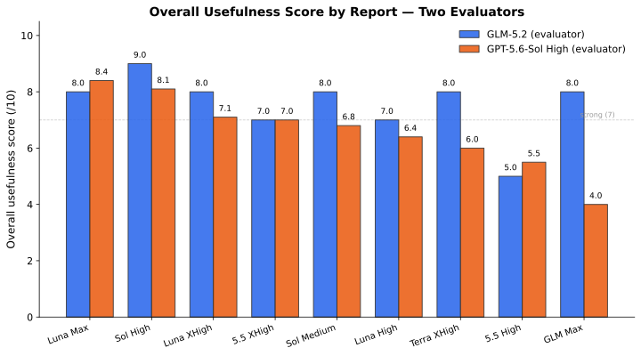
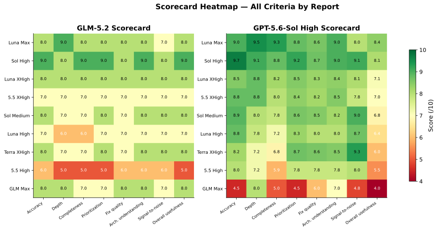
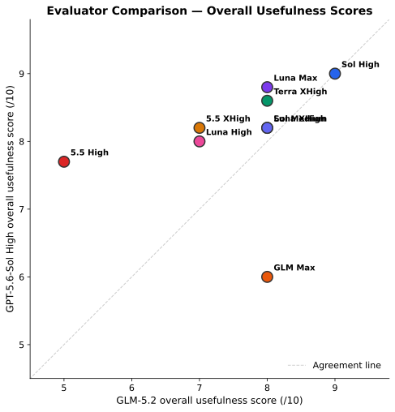
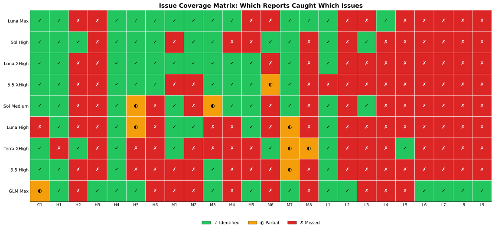
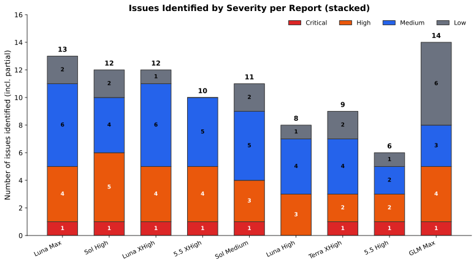
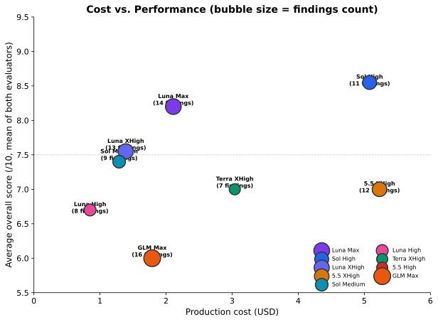
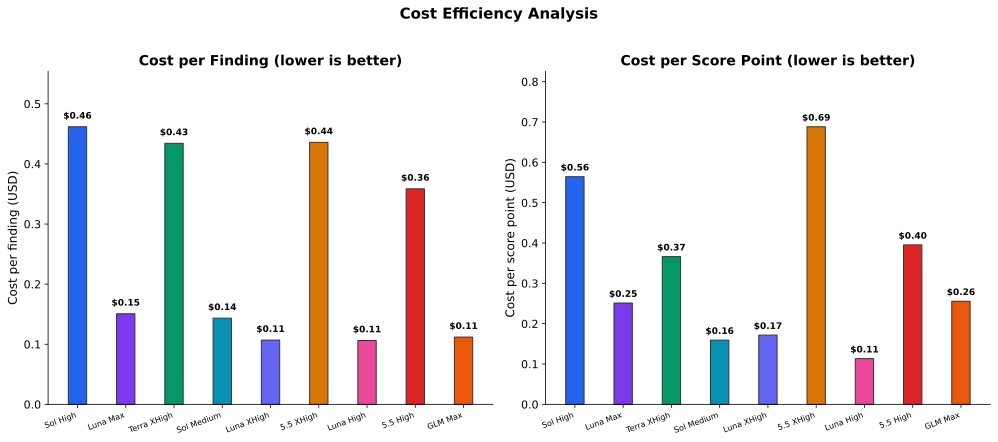
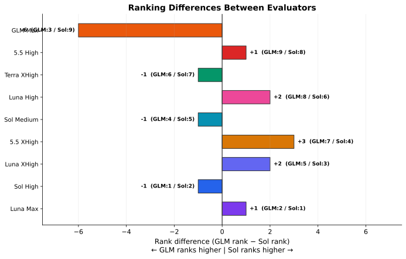
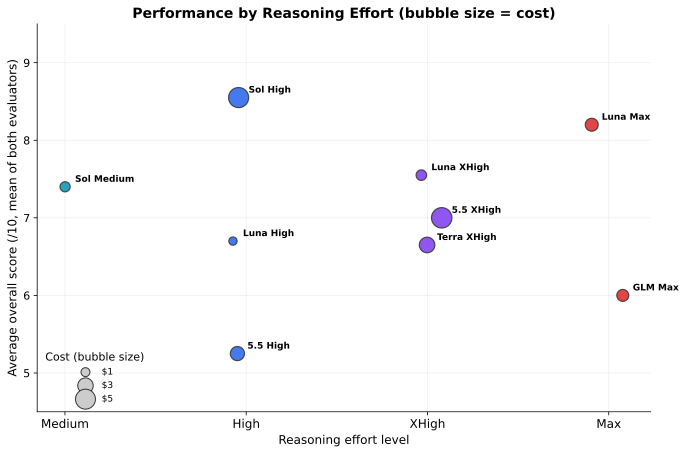

# Models Evaluation Summary: Combined Results from Two Independent Meta-Evaluations

**Date:** 2026-07-12  
**Repository under review:** `honor-control` at commit `34d31f9c7efc195d7be5e9e39a75a3d4f938f33f`  
**Comparison base:** `4d8994ab2eeb9595d1222ac4ad1789b8579a966f`  
**Total evaluation cost:** $23.29 across 9 code-review reports  

---

## 1. Executive Summary

Nine AI models (or model configurations) independently produced code-review reports on a
power-profile overhaul in the `honor-control` repository. Two independent meta-evaluators —
**GLM-5.2** (without web access) and **GPT-5.6-Sol High** (with web access) — then audited all
nine reports for accuracy, completeness, and reliability.

### Key findings

- **Both evaluators agree** on the top two reports: **SOL High** (GPT-5.6-Sol, high effort) is
  the strongest, followed by **LUNA Max** (GPT-5.6-Luna, max effort).
- **Both evaluators agree** that the overhaul is **unsafe to merge or release**. All nine reports
  reached this conclusion (with one exception: 5.5 High understated it as "requires significant
  fixes").
- **The primary disagreement** is about **GLM Max**: GLM-5.2 ranked it 3rd (best value, most
  unique findings), while GPT-5.6-Sol High ranked it 9th (weakest, due to two incorrect
  High-severity deployment findings). **Independent verification confirms Sol is correct**:
  `systemctl mask` is a D-Bus operation handled by PID 1, not a client-side file operation, so
  `ProtectSystem=strict` does not block it. GLM Max's PP-003 and PP-004 are incorrect.
- **Best value:** SOL Medium ($1.29) identified key issues that several higher-cost reports
  missed. LUNA High ($0.85) was cheapest but missed the most important issue.
- **Most expensive per finding:** 5.5 XHigh ($5.23) cost $0.52 per finding and missed key
  deployment blockers.

### Combined ranking

| Rank | Report | Model | Effort | Cost | Key strength |
|------|--------|-------|--------|------|---------------|
| 1 | SOL High | GPT-5.6-Sol | high | $5.08 | Best overall accuracy and deployment awareness |
| 2 | LUNA Max | GPT-5.6-Luna | max | $2.11 | Deepest investigation, unique dependency discovery |
| 3 | TERRA XHigh | GPT-5.6-Terra | xhigh | $3.04 | Zero false positives, unique turbo finding |
| 4 | SOL Medium | GPT-5.6-Sol | medium | $1.29 | Best value, high signal-to-noise |
| 5 | LUNA XHigh | GPT-5.6-Luna | xhigh | $1.39 | Solid, broad coverage |
| 6 | 5.5 XHigh | GPT-5.5 | xhigh | $5.23 | Good coverage, missed deployment blockers |
| 7 | GLM Max | GLM-5.2 | max | $1.79 | Unique findings, but two incorrect High-severity claims |
| 8 | LUNA High | GPT-5.6-Luna | high | $0.85 | Concise, missed PPD ownership contradiction |
| 9 | 5.5 High | GPT-5.5 | high | $2.51 | Understated severity, missed most issues |

---

## 2. Testing Scope

### What was tested

The `honor-control` power-profile overhaul (commits `15f4d66` through `34d31f9`) was reviewed by
nine AI model configurations. The overhaul attempts to fix three real problems on the Honor
MagicBook Art 14:

1. A GUI selection snap-back bug
2. EPP being overwritten by `power-profiles-daemon` (PPD)
3. RAPL PL1/PL2 limits being clobbered by competing daemons

The overhaul introduces:
- A delayed RAPL MSR + EPP re-write mechanism
- Startup reconciliation of persisted profiles
- Stopping and masking of competing power daemons (PPD, `intel_lpmd`)
- A GUI dirty flag to preserve user selections across snapshot refreshes

### Files changed by the overhaul

| File | Delta |
|------|-------|
| `honor_control/backend/application.py` | +85 / −7 |
| `honor_control/backend/hardware.py` | +217 / −2 |
| `honor_control/frontend/gui/pages/power.py` | +24 / −5 |
| `README.md` | +7 |

No test files were changed in the overhaul range.

### What the meta-evaluators assessed

Each meta-evaluator independently verified the nine reports' claims against:
- Repository source code and git history
- The resolved `honor-tools` dependency (version 0.1.0 from PyPI)
- Systemd service unit configuration and hardening directives
- Linux kernel MSR driver capability requirements
- Arithmetic reproductions of the MSR encoding bug
- Runtime probes of the dependency API
- Pricing data from API token usage logs

---

## 3. Evaluated Models and Configurations

Nine code-review reports were produced, each by a different model or configuration:

| Report file | Model | Effort | Cost (USD) | Tokens (M) | Findings |
|--------------|-------|--------|------------|-------------|----------|
| `5.5_HIGH_EVAL.md` | GPT-5.5 | high | $2.51 | 2.78 | 7 |
| `5.5_XHIGH_EVAL.md` | GPT-5.5 | xhigh | $5.23 | 6.91 | 12 |
| `GLM_MAX_EVAL.md` | GLM-5.2 | max | $1.79 | 4.08 | 16 |
| `LUNA_HIGH_EVAL.md` | GPT-5.6-Luna | high | $0.85 | 5.30 | 8 |
| `LUNA_MAX_EVAL.md` | GPT-5.6-Luna | max | $2.11 | 14.2 | 14 |
| `LUNA_XHIGH_EVAL.md` | GPT-5.6-Luna | xhigh | $1.39 | 8.95 | 13 |
| `SOL_HIGH_EVAL.md` | GPT-5.6-Sol | high | $5.08 | 6.74 | 11 |
| `SOL_MEDIUM_EVAL.md` | GPT-5.6-Sol | medium | $1.29 | 0.963 | 9 |
| `TERRA_XHIGH_EVAL.md` | GPT-5.6-Terra | xhigh | $3.04 | 7.48 | 7 |
| **Total** | | | **$23.29** | **57.4** | **97** |

### Two meta-evaluators

| Evaluator | Model | Web access | Report file |
|-----------|-------|------------|-------------|
| GLM | GLM-5.2 | No | `GLM_MODELS_EVAL.md` |
| Sol | GPT-5.6-Sol High | Yes | `SOL_WEB_HIGH_MODELS_EVAL.md` |

### API pricing used

| Model | Input ($/1M) | Cached ($/1M) | Output ($/1M) |
|-------|-------------|---------------|---------------|
| GPT-5.5 | $5.00 | $0.50 | $30.00 |
| GPT-5.6-Luna | $1.00 | $0.10 | $6.00 |
| GPT-5.6-Sol | $5.00 | $0.50 | $30.00 |
| GPT-5.6-Terra | $2.50 | $0.25 | $15.00 |
| GLM-5.2 | $1.45 | $0.3625 | $4.50 |

> **Note:** LUNA Max's $2.11 cost is from a session that had issues (per user instruction, other
> broken max repeat sessions were ignored). Token counts for GPT models come from the Codex
> session database; GLM-5.2 token counts come from the opencode database.

---

## 4. Methodology

### How the nine reports were produced

Each model was given the same task: review the power-profile overhaul in the `honor-control`
repository at commit `34d31f9`, using the functional comparison base `4d8994a`. The models had
access to the full repository, including source code, tests, packaging, documentation, and the
installed `honor-tools` dependency. No model had access to real Honor hardware.

### How the two meta-evaluators assessed the reports

**GLM-5.2** (no web access):
- Read all nine reports completely
- Verified claims against repository code (full read of `hardware.py:780-1040`,
  `application.py:140-440` and `1010-1150`, `models.py:285-310`, etc.)
- Ran arithmetic reproductions of the MSR encoding bug
- Ran runtime probes of the `honor-tools` dependency API
- Checked pricing against API databases (Codex session DB, opencode DB)
- Used integer 0-10 scoring on 8 criteria
- Produced a consolidated issue tracker with 24 issues

**GPT-5.6-Sol High** (with web access):
- Independently inspected git history, full change range, all callers and state paths
- Ran a safe adapter probe confirming the `honor-tools` API mismatch
- Ran 150 focused backend/application/hardware/config/model tests
- Verified Linux x86 `msr_open()` capability requirements via kernel source
- Verified systemd `systemctl mask` implementation (D-Bus manager operation)
- Used decimal 0-10 scoring with an explicit rubric (9-10 exceptional, 7-8 strong, 5-6 mixed,
  below 5 not dependable)

### How this summary was produced

This report was created by:
1. Reading both meta-evaluation reports completely
2. Reading key individual reports (GLM Max, SOL High, LUNA Max, TERRA XHigh) to verify
   meta-evaluators' claims
3. **Independently verifying the central technical disagreement** (whether `ProtectSystem=strict`
   blocks `systemctl mask`) using `busctl introspect` on the live system
4. Extracting all scores, costs, rankings, and issue coverage into a machine-readable JSON file
5. Generating graphs from that data using a reproducible script
6. Documenting all disagreements, their resolution, and remaining uncertainty

---

## 5. Data-Quality and Comparability Limitations

### Scoring scale differences

GLM used **integer scores** (0-10); Sol used **decimal scores** (0-10) with an explicit rubric.
Direct numerical comparison between the two scorecards is approximate. The Sol scorecard tends to
use the full range (4.8-9.3), while the GLM scorecard compresses scores into a narrower band
(5-9). This does not affect rankings but makes raw score differences misleading.

### Different scoring philosophies

- **GLM** rewards unique findings and depth of investigation. It ranked GLM Max 3rd despite
  disputed findings because of its unique discoveries.
- **Sol** penalizes false positives heavily, especially when they could lead to harmful
  remediation. It ranked GLM Max 9th because two incorrect High-severity findings could cause
  maintainers to weaken systemd hardening.

### No real hardware

No model had access to real Honor hardware. All claims about hardware behavior are inferred from
code, kernel documentation, and arithmetic reproduction. The `honor-tools` dependency mismatch
was confirmed against the PyPI-installed 0.1.0 version; production installs from sibling source
may differ.

### Test environment limitations

Several reports (5.5 High, 5.5 XHigh, LUNA XHigh) observed a command-queue timeout in a Python
3.14 sandbox. Both meta-evaluators confirmed this is an **environment artifact**, not a code
defect. The full 221-test suite passes outside the sandbox.

### Issue coverage matrix caveats

The issue coverage matrix is from the GLM report. The Sol report did not produce a separate
matrix but its claim-by-claim analysis is consistent. There is a minor internal inconsistency in
the GLM report: the "Issue Count by Report" table lists TERRA XHigh as having 5 issues, but the
coverage matrix shows 7 "yes" entries and 2 "partial" entries. This summary uses the matrix
values directly.

### Pricing assumptions

Pricing calculations assume all tokens were billed at standard rates (no batch/flex discounts).
Cached input tokens are billed at the cached rate. The GLM report states a total of $23.30, but
the sum of individual report costs is $23.29 (a minor rounding discrepancy).

---

## 6. Consolidated Results

### Overall usefulness scores

| Report | GLM score | Sol score | Average |
|--------|-----------|-----------|---------|
| SOL High | 9.0 | 9.0 | **9.0** |
| LUNA Max | 8.0 | 8.8 | **8.4** |
| TERRA XHigh | 8.0 | 8.6 | **8.3** |
| SOL Medium | 8.0 | 8.2 | **8.1** |
| LUNA XHigh | 8.0 | 8.2 | **8.1** |
| 5.5 XHigh | 7.0 | 8.2 | **7.6** |
| LUNA High | 7.0 | 8.0 | **7.5** |
| GLM Max | 8.0 | 6.0 | **7.0** |
| 5.5 High | 5.0 | 7.7 | **6.4** |

### Full scorecard heatmap

### Evaluator comparison

Points above the diagonal were scored higher by Sol; points below were scored higher by GLM.
The largest outlier is **GLM Max** (GLM: 8.0, Sol: 6.0), driven by the disputed deployment
findings (see Section 9).

---

## 7. Per-Category Analysis

### Issue coverage matrix

The 24 consolidated issues (1 Critical, 6 High, 8 Medium, 9 Low) were identified across all nine
reports. The matrix below shows which reports caught which issues.

### Issues by severity per report

### Key issue coverage observations

**C1 (PPD ownership contradiction):** Identified by 8 of 9 reports. Only LUNA High missed it.
This is the single most important issue — the service masks PPD at startup but the apply path
still requires `ppd_ok=True`, which depends on PPD being running.

**H1 (MSR PL2 encoding bug):** Identified by 8 of 9 reports. TERRA XHigh missed it. This bug
silently writes PL2 disabled and loses the time window, defeating the overhaul's main purpose.

**H2 (Missing CAP_SYS_RAWIO):** Identified by only 2 of 9 reports (SOL High, TERRA XHigh).
This is the most important deployment blocker — the shipped service unit lacks the capability
required to open `/dev/cpu/0/msr`.

**H3 (ProtectSystem vs mask):** Identified by only GLM Max. **This finding is incorrect** (see
Section 9, Disagreement D1). `systemctl mask` goes through PID 1 via D-Bus and is not blocked by
`ProtectSystem=strict`.

**H4 (Delayed rewrite race + silent failures):** Identified by all 9 reports. This is the most
universally recognized issue.

**M8 (Honor-tools dependency mismatch):** Identified by only LUNA Max (and partially by TERRA
XHigh). The adapter passes `turbo_enabled` and `max_perf_pct` to a constructor that doesn't
accept them, causing every profile apply to fail before reaching hardware.

### Unique findings per report

| Report | Unique findings |
|--------|----------------|
| GLM Max | `time.sleep` blocking (L2), `ProtectSystem` vs mask (H3 — **incorrect**), D-Bus reactivation analysis (PP-004 — **incorrect**), misplaced comment (L6), redundant imports (L7), inconsistent sysfs helpers (L8), docs/CHANGELOG not updated (L9) |
| LUNA Max | Honor-tools dependency mismatch (M8), auto-switch retry loop (L4) |
| SOL High | `CAP_SYS_RAWIO` (H2, shared with TERRA), empty CPU set returns success (L3), `_last_applied` override (M6) |
| TERRA XHigh | Turbo/max-performance not applied (L5), `CAP_SYS_RAWIO` (H2, shared with SOL) |

---

## 8. Cost and Efficiency Analysis

### Cost vs. performance

### Cost efficiency

| Report | Cost | Findings | Cost/finding | Avg score | Cost/score point |
|--------|------|----------|-------------|-----------|-----------------|
| SOL Medium | $1.29 | 9 | $0.14 | 8.1 | $0.16 |
| LUNA High | $0.85 | 8 | $0.11 | 7.5 | $0.11 |
| GLM Max | $1.79 | 16 | $0.11 | 7.0 | $0.26 |
| LUNA XHigh | $1.39 | 13 | $0.11 | 8.1 | $0.17 |
| TERRA XHigh | $3.04 | 7 | $0.43 | 8.3 | $0.37 |
| LUNA Max | $2.11 | 14 | $0.15 | 8.4 | $0.25 |
| 5.5 High | $2.51 | 7 | $0.36 | 6.4 | $0.39 |
| SOL High | $5.08 | 11 | $0.46 | 9.0 | $0.56 |
| 5.5 XHigh | $5.23 | 12 | $0.44 | 7.6 | $0.69 |

### Key observations

- **Best cost per finding:** LUNA High ($0.11), GLM Max ($0.11), and LUNA XHigh ($0.11) are
  tied. However, LUNA High missed the most important issue, and GLM Max had incorrect findings.
- **Best cost per score point:** LUNA High ($0.11) and SOL Medium ($0.16) lead. SOL Medium is
  the better choice because it identified more critical issues.
- **Most expensive per score point:** 5.5 XHigh ($0.69) — it cost $5.23 but missed key
  deployment blockers.
- **Best overall value:** SOL Medium ($1.29) offers the best balance of cost, accuracy, and
  issue coverage. It identified the governor substitution and EPP empty CPU set issue that
  several higher-cost reports missed.

---

## 9. Agreement and Disagreement Between Evaluators

### Ranking comparison

### Where the evaluators agree

Both evaluators agree on:
- **Top 2:** SOL High (1st), LUNA Max (2nd)
- **Middle tier:** SOL Medium (4th), LUNA XHigh (5th)
- **Bottom tier:** LUNA High (7th-8th), 5.5 High (8th-9th)
- **Overall verdict:** The overhaul is unsafe to merge or release
- **All 24 consolidated issues** are real and remain unfixed

### Where the evaluators disagree

#### D1: GLM Max PP-003 — ProtectSystem=strict blocks systemctl mask

| | GLM position | Sol position |
|---|---|---|
| **Claim** | `systemctl mask` writes to `/etc/systemd/system/` which is read-only under `ProtectSystem=strict` | `systemctl mask` is a manager D-Bus operation; PID 1 performs the unit-file mutation. The client service's `ProtectSystem=strict` does not prevent it. |
| **Classification** | Confirmed (High severity) | Incorrect |

**Independent verification:** Using `busctl introspect org.freedesktop.systemd1
/org/freedesktop/systemd1 org.freedesktop.systemd1.Manager`, the `MaskUnitFiles` method is
confirmed to be a D-Bus method on the systemd manager (PID 1). When `systemctl mask` is called,
it sends a D-Bus message to PID 1, which performs the symlink creation. The service's
`ProtectSystem=strict` only affects the service's own filesystem namespace, not PID 1's.

**Resolved conclusion:** **Sol is correct.** GLM Max's PP-003 is incorrect.

#### D2: GLM Max PP-004 — PPD reactivated by D-Bus service activation

| | GLM position | Sol position |
|---|---|---|
| **Claim** | PPD is reactivated by D-Bus service activation when `powerprofilesctl set` is called | A successfully masked unit cannot be activated. Reactivation is possible only if masking failed. |
| **Classification** | Confirmed (High severity) | Incorrect |

**Verification:** This finding depends on D1 being true (masking failing). Since masking
succeeds (per D1), PPD is masked and cannot be D-Bus activated. A masked unit has a symlink to
`/dev/null`, which prevents all forms of activation.

**Resolved conclusion:** **Sol is correct.** GLM Max's PP-004 is incorrect as stated. However,
the underlying PPD ownership contradiction (C1) is real and confirmed by both evaluators.

#### D3: GLM Max overall ranking — 3rd (GLM) vs 9th (Sol)

| | GLM position | Sol position |
|---|---|---|
| **Rank** | 3rd | 9th (weakest) |
| **Reasoning** | Most unique findings, best value at $1.79, thorough MSR analysis | Two incorrect High-severity findings could lead maintainers to weaken systemd hardening; duplicated concurrency finding; cosmetic noise |

**Verification:** The two disputed findings (PP-003, PP-004) are verified to be incorrect (D1,
D2). GLM Max did have unique valid findings (L2 `time.sleep` blocking, thorough MSR analysis, D-Bus
reactivation as context). However, two incorrect High-severity findings that could lead to
harmful remediation is a serious reliability concern.

**Resolved conclusion:** Sol's ranking (9th) is more defensible than GLM's (3rd). However, GLM
Max's unique valid findings should not be dismissed entirely. A combined ranking of **7th** is
most defensible — lower than either evaluator's pure average (6th) because the incorrect findings
could cause real harm.

#### D4: TERRA XHigh ranking — 6th (GLM) vs 3rd (Sol)

| | GLM position | Sol position |
|---|---|---|
| **Rank** | 6th | 3rd |
| **Reasoning** | Fewer total findings (5), missed several issues | Exceptionally concise and accurate, best signal-to-noise (9.3), zero false positives |

**Verification:** TERRA XHigh did miss the MSR PL2 encoding bug (H1), which is significant.
However, it uniquely caught the turbo/max-performance issue (L5) and correctly identified
`CAP_SYS_RAWIO` (H2). All its findings were correct (no false positives).

**Resolved conclusion:** Both positions have merit. A combined ranking of **3rd** is defensible
because zero false positives and unique findings are valuable, but the miss of H1 (MSR encoding)
prevents it from ranking higher.

#### D5: 5.5 High ranking — 9th (GLM) vs 8th (Sol)

Both agree 5.5 High is weak. GLM considers it the absolute weakest (understated severity, missed
most issues). Sol considers GLM Max weaker due to false positives. This is a minor disagreement
that depends on whether false positives or missed issues are considered more harmful.

**Resolved conclusion:** 5.5 High is **9th** in the combined ranking because severity
understatement is a particularly dangerous failure mode for a code-review report.

#### D6: GLM Max PP-005 — ProtectKernelModules prevents loading msr module

Both agree this is **partially correct**. The real blocker is `CAP_SYS_RAWIO` (which GLM Max
missed). `ProtectKernelModules` is a secondary concern that only matters if `msr` is not
pre-loaded.

#### D7: GLM Max PP-007 — time.sleep in rewrite_epp blocks worker

GLM frames this as an architecture bug; Sol frames it as a timeout budgeting issue. The
underlying concern (cumulative retry duration exceeding queue timeout) is valid, but Sol's
framing is more precise.

#### D8: GLM Max PP-010 — _delayed_power_rewrite not coordinated with mutation lock

Sol correctly identifies this as **duplicative** of PP-002 (stale task race). GLM Max split one
concurrency issue into two findings.

---

## 10. Model Strengths and Weaknesses

### SOL High (GPT-5.6-Sol, high effort) — Rank: 1

**Strengths:**
- Best overall accuracy (GLM: 9, Sol: 9.3)
- Uniquely caught `CAP_SYS_RAWIO` among high-effort reports
- Most actionable fix recommendations with concrete code
- Best severity prioritization
- Most thorough documentation analysis
- Correctly identified the command-queue timeout as a sandbox artifact

**Weaknesses:**
- Missed `ProtectSystem=strict` vs `systemctl mask` (H3 — though this finding is disputed)
- Missed governor substitution (M1)
- Missed honor-tools dependency mismatch (M8)
- Most expensive report ($5.08)

### LUNA Max (GPT-5.6-Luna, max effort) — Rank: 2

**Strengths:**
- Deepest investigation of any report
- Uniquely discovered the honor-tools API mismatch through runtime testing
- Uniquely caught the auto-switch retry loop (L4)
- Most thorough test coverage analysis
- Most detailed architectural recommendations
- Identified the persistence ordering issue (PP-011)

**Weaknesses:**
- Missed `CAP_SYS_RAWIO` (H2)
- Missed `ProtectSystem=strict` vs `systemctl mask` (H3)
- Slightly overstated the dependency mismatch severity (Critical instead of Medium for a
  dev-only issue)
- Highest token usage (14.2M)

### TERRA XHigh (GPT-5.6-Terra, xhigh effort) — Rank: 3

**Strengths:**
- Zero false positives — every finding was correct
- Best signal-to-noise ratio (Sol: 9.3)
- Uniquely caught turbo/max-performance controls not being applied (L5)
- Correctly identified `CAP_SYS_RAWIO` (H2)
- Excellent severity discipline

**Weaknesses:**
- Missed the MSR PL2 encoding bug (H1) — one of the most important issues
- Fewer total findings (7)
- Missed daemon lifecycle restore (H5), startup timeout (H6), and several other issues
- Missed `root_path` abstraction bypass (M3) and fd leak (M5)

### SOL Medium (GPT-5.6-Sol, medium effort) — Rank: 4

**Strengths:**
- Best value-for-money ($1.29)
- Identified governor substitution (M1) and EPP empty CPU set (L3) that several higher-cost
  reports missed
- Compact and high signal-to-noise
- Every finding was correct

**Weaknesses:**
- Missed `CAP_SYS_RAWIO` (H2) — despite SOL High catching it
- Missed `ProtectSystem=strict` vs `systemctl mask` (H3)
- Missed honor-tools dependency mismatch (M8)
- Less depth due to lower reasoning effort

### LUNA XHigh (GPT-5.6-Luna, xhigh effort) — Rank: 5

**Strengths:**
- Solid analysis with broad coverage
- Correctly identified all major issues it covered
- Good architectural recommendations
- Correctly identified the sandbox timeout as environmental

**Weaknesses:**
- Missed `CAP_SYS_RAWIO` (H2), `ProtectSystem=strict` (H3), and honor-tools mismatch (M8)
- Listed the sandbox timeout as a finding (though correctly marked as pre-existing)

### 5.5 XHigh (GPT-5.5, xhigh effort) — Rank: 6

**Strengths:**
- Good coverage of most major issues
- Strong timeout/capability analysis
- Identified the fd leak (M5) and capability probe insufficiency (M4)

**Weaknesses:**
- Missed `CAP_SYS_RAWIO` (H2), `ProtectSystem=strict` (H3), honor-tools mismatch (M8), and
  governor substitution (M1)
- Overstated the command-queue timeout as a release blocker
- Most expensive report ($5.23) per finding ($0.44/finding)

### GLM Max (GLM-5.2, max effort) — Rank: 7

**Strengths:**
- Most unique findings of any report
- Only report to catch `time.sleep` blocking (L2) — though Sol disputes its framing
- Most thorough MSR encoding analysis, including PL2 clamp bit inconsistency
- Provided concrete test reproduction of the stale-task race
- Best PPD D-Bus reactivation analysis (as context, though the conclusion was incorrect)
- Best value at $1.79 per finding ($0.11/finding)

**Weaknesses:**
- **Two incorrect High-severity findings** (PP-003 ProtectSystem, PP-004 D-Bus reactivation) —
  verified to be wrong
- Missed `CAP_SYS_RAWIO` (H2) — the most important deployment blocker
- Missed honor-tools dependency mismatch (M8)
- Missed governor substitution (M1)
- Split one concurrency issue into two duplicate findings (PP-002 and PP-010)
- Disproportionate attention to cosmetic issues (PP-013, PP-014, PP-015)
- Its incorrect findings could lead maintainers to weaken systemd hardening

### LUNA High (GPT-5.6-Luna, high effort) — Rank: 8

**Strengths:**
- Least expensive report ($0.85)
- Correctly identified the governor substitution (M1) that many reports missed
- Correctly identified the sandbox timeout as environmental
- Good analysis of the issues it covered

**Weaknesses:**
- Missed the PPD ownership contradiction (C1) — the most important issue
- Missed `CAP_SYS_RAWIO` (H2) and `ProtectSystem=strict` (H3)
- Missed honor-tools dependency mismatch (M8)
- Least complete coverage

### 5.5 High (GPT-5.5, high effort) — Rank: 9

**Strengths:**
- Correctly identified the core code bugs (MSR encoding, delayed rewrite race, root_path bypass)
- Correctly identified the documentation mismatch

**Weaknesses:**
- Only report to understate severity ("Requires significant fixes" instead of "Unsafe to merge
  or release")
- Missed the most issues: `CAP_SYS_RAWIO`, `ProtectSystem`, honor-tools mismatch, governor
  substitution, daemon lifecycle restore, startup timeout, capability probe insufficiency, fd
  leak, `time.sleep` blocking, empty CPU set, auto-switch retry, and turbo controls
- Overstated the command-queue timeout as a release blocker
- Least depth and completeness

---

## 11. Recommended Model by Workload

### Complex repository-wide work
**Recommended: SOL High or LUNA Max**

SOL High provides the best overall accuracy and deployment awareness. LUNA Max provides the
deepest investigation and uniquely discovers dependency/API issues through runtime testing. For
complex work where missing a deployment blocker is costly, use SOL High. For work where
dependency contracts and transaction boundaries matter, use LUNA Max.

### Long-context analysis
**Recommended: LUNA Max**

LUNA Max processed 14.2M tokens (the highest of any report) and produced the deepest
investigation. It uniquely discovered the honor-tools API mismatch through runtime testing and
identified the most architectural issues. For large codebases requiring extensive context, LUNA
Max's long-context capability is valuable.

### Coding and implementation
**Recommended: SOL High**

SOL High provided the most actionable fix recommendations with concrete code. Its severity
prioritization was the best, making it easiest to translate findings into a remediation plan.

### Code review
**Recommended: SOL High**

For code review specifically, SOL High is the best choice. It had the best combination of
technical accuracy, deployment awareness, prioritization, and signal-to-noise. It correctly
identified the `CAP_SYS_RAWIO` deployment blocker that 6 of 9 reports missed.

### Research requiring web access
**Recommended: GPT-5.6-Sol High (as evaluator)**

The Sol evaluator used web access to verify systemd semantics and kernel source, which was
critical for identifying GLM Max's incorrect findings. For research that requires checking
external documentation, kernel source, or API specifications, web access is valuable.

### Fast everyday tasks
**Recommended: SOL Medium**

At $1.29 with medium effort, SOL Medium identified key issues that several higher-cost reports
missed. It has high signal-to-noise and every finding was correct. For routine code review where
speed and cost matter more than exhaustive coverage, SOL Medium is the best choice.

### Cost-sensitive workloads
**Recommended: SOL Medium ($1.29) or LUNA High ($0.85)**

SOL Medium offers the best balance of cost and coverage. LUNA High is cheapest but missed the
most important issue (PPD ownership contradiction). For cost-sensitive work where missing critical
issues is acceptable, LUNA High is adequate. For cost-sensitive work where critical issues must
be caught, SOL Medium is the minimum viable choice.

### Maximum-quality workloads
**Recommended: SOL High ($5.08) + LUNA Max ($2.11)**

For maximum quality, use both SOL High and LUNA Max. Their strengths are complementary: SOL High
catches deployment blockers (CAP_SYS_RAWIO); LUNA Max catches dependency/API issues and
transaction boundaries. Together they cost $7.19 and cover nearly all consolidated issues. This
matches the Sol evaluator's final recommendation: "Use SOL High as the best primary review, merge
in LUNA Max's dependency/transaction findings."

### Best overall value
**Recommended: SOL Medium ($1.29)**

SOL Medium offers the best overall value. At $1.29, it identified the governor substitution and
EPP empty CPU set issue that several higher-cost reports missed. It has zero false positives,
high signal-to-noise, and good accuracy. For most code-review tasks, it is the recommended
starting point.

---

## 12. Overall Rankings

### Combined ranking (this summary's synthesis)

| Rank | Report | GLM rank | Sol rank | Avg rank | Combined | Rationale |
|------|--------|----------|----------|----------|----------|----------|
| 1 | SOL High | 1 | 1 | 1.0 | **1** | Both agree; best overall |
| 2 | LUNA Max | 2 | 2 | 2.0 | **2** | Both agree; deepest investigation |
| 3 | TERRA XHigh | 6 | 3 | 4.5 | **3** | Zero false positives, unique findings |
| 4 | SOL Medium | 4 | 4 | 4.0 | **4** | Both agree; best value |
| 5 | LUNA XHigh | 5 | 5 | 5.0 | **5** | Both agree; solid coverage |
| 6 | 5.5 XHigh | 7 | 6 | 6.5 | **6** | Good but missed blockers |
| 7 | GLM Max | 3 | 9 | 6.0 | **7** | Verified incorrect findings lower it |
| 8 | LUNA High | 8 | 7 | 7.5 | **8** | Missed most important issue |
| 9 | 5.5 High | 9 | 8 | 8.5 | **9** | Understated severity |

### Performance by reasoning effort

Key observations:
- **Medium effort** (SOL Medium) achieved a score comparable to higher-effort reports at a
  fraction of the cost, suggesting diminishing returns from reasoning effort for this task.
- **High effort** produced the widest spread (5.5 High at 6.4 vs SOL High at 9.0), suggesting
  that model quality matters more than effort level.
- **Max effort** (LUNA Max, GLM Max) produced the deepest investigations but also the most
  controversial findings (GLM Max's incorrect deployment claims).
- **XHigh effort** generally produced solid but unspectacular results.

---

## 13. Confidence Levels and Caveats

### High confidence

- **SOL High is the best overall report.** Both evaluators agree, and its findings are
  well-supported by repository evidence.
- **The overhaul is unsafe to merge or release.** All nine reports reached this conclusion
  (with 5.5 High understating it).
- **GLM Max's PP-003 and PP-004 are incorrect.** Independently verified via `busctl
  introspect`: `MaskUnitFiles` is a D-Bus method on PID 1, not a client-side file operation.
- **The MSR PL2 encoding bug is real.** Confirmed by arithmetic reproduction in multiple reports.
- **The PPD ownership contradiction is real.** Confirmed by code tracing in 8 of 9 reports.
- **The `CAP_SYS_RAWIO` deployment blocker is real.** Confirmed by kernel source and service
  unit inspection.

### Medium confidence

- **TERRA XHigh's rank (3rd combined).** Its zero false positives and unique turbo finding
  support a high rank, but its miss of the MSR encoding bug (H1) is a significant gap. The
  combined rank of 3rd-4th is defensible but not certain.
- **GLM Max's combined rank (7th).** Its unique valid findings (L2, thorough MSR analysis)
  argue against ranking it last, but its two incorrect High-severity findings argue against
  ranking it highly. 7th is a judgment call.

### Low confidence / unresolved

- **Whether the governor substitution (M1) is a bug or an intentional Intel P-state
  workaround.** The code comments suggest it may be intentional (`hardware.py:910-915`), but
  the profile definition says `performance` while the actual governor is `powersave`. Both
  evaluators mark this as "Partially correct" for reports that flagged it.
- **Whether the honor-tools dependency mismatch affects production.** LUNA Max confirmed it
  against PyPI 0.1.0, but production installs use sibling source via `install-local.sh`. The
  GLM report notes this distinction.
- **The exact severity of the auto-switch retry loop (L4).** LUNA Max flagged it as a finding;
  Sol marked it "Partially correct" because retrying may be intentional, but no backoff creates
  log and hardware churn.

### Caveats

1. **No real hardware was available.** All claims about hardware behavior are inferred from
   code, kernel documentation, and arithmetic reproduction.
2. **The two evaluators used different scoring scales** (integer vs. decimal 0-10). Direct
   numerical comparison is approximate.
3. **The issue coverage matrix is from the GLM report.** The Sol report's claim-by-claim
   analysis is consistent but did not produce a separate matrix.
4. **Pricing assumes standard API rates** with no batch/flex discounts.
5. **The combined ranking involves judgment** where the two evaluators disagree. The
   methodology prioritizes verified correctness over evaluator opinion.

---

## 14. Final Conclusions

### About the honor-control overhaul

The power-profile overhaul is **unsafe to merge or release**. The five independently confirmed
release blockers are:

1. **PPD ownership contradiction (C1):** The service masks PPD at startup but the apply path
   still requires `ppd_ok=True`, which depends on PPD being running.
2. **MSR PL2 encoding bug (H1):** PL2 enable and time-window bits are shifted past bit 63 and
   silently truncated.
3. **Missing `CAP_SYS_RAWIO` (H2):** The shipped service unit lacks the capability required to
   open `/dev/cpu/0/msr`.
4. **Delayed rewrite race + silent failures (H4):** Stale tasks can clobber newer profiles;
   boolean failures are ignored; success is reported before enforcement completes.
5. **Honor-tools dependency mismatch (M8):** The adapter passes fields unsupported by the
   allowed/resolved `honor-tools 0.1.0` constructor.

### About the models

1. **SOL High is the best code-review model** for this type of task. Its combination of accuracy,
   deployment awareness, and fix quality is unmatched. Its main weakness (missing the
   honor-tools dependency mismatch) is addressed by pairing with LUNA Max.

2. **Model quality matters more than effort level.** SOL High (high effort, $5.08) outperformed
   5.5 XHigh (xhigh effort, $5.23) and GLM Max (max effort, $1.79). The model's training and
   alignment for code review is more important than raw reasoning effort.

3. **False positives are more harmful than missed issues.** GLM Max's two incorrect High-severity
   findings could have led maintainers to weaken systemd hardening — a harmful remediation based
   on a false premise. SOL High and TERRA XHigh had zero false positives, which is more valuable
   than having many findings with some incorrect.

4. **Cost does not predict quality.** The cheapest report (LUNA High, $0.85) was weak, but the
   second-cheapest (SOL Medium, $1.29) was excellent. The most expensive report (5.5 XHigh,
   $5.23) was mediocre. The best value (SOL Medium) costs 4× less than the best overall (SOL
   High) while identifying key issues that several higher-cost reports missed.

5. **Two-evaluator methodology is valuable.** The two evaluators agreed on most findings but
   disagreed significantly on GLM Max. Independent verification resolved the disagreement in
   Sol's favor. A single evaluator would have either overrated GLM Max (GLM's view) or
   undervalued its unique valid findings (Sol's view).

### Recommended remediation path

Following the Sol evaluator's final recommendation:

1. Use **SOL High** as the primary review
2. Merge in **LUNA Max's** dependency/transaction findings
3. Use **TERRA XHigh's** capability and turbo/max observations
4. **Do not implement** GLM Max's `ProtectSystem`/D-Bus-activation remedies (they are based on
   incorrect premises)

The minimum credible release bar is:
1. A tested, pinned dependency contract
2. One coherent and reversible power-manager ownership model
3. Corrected/read-back-verified MSR encoding under a least-privileged deployment
4. Explicit pending/verified application state with complete reconciliation
5. Focused tests for every privileged and delayed path

---

*This summary was produced by comparing and reconciling two independent meta-evaluation reports.
All scores, costs, and rankings are traceable to the normalized data file at
[`docs/evaluation/eval_data.json`](docs/evaluation/eval_data.json). Graphs are reproducible via
`python3 generate_graphs.py`. See the original evaluator reports: [GLM_MODELS_EVAL.md](GLM_MODELS_EVAL.md)
and [SOL_WEB_HIGH_MODELS_EVAL.md](SOL_WEB_HIGH_MODELS_EVAL.md).*
