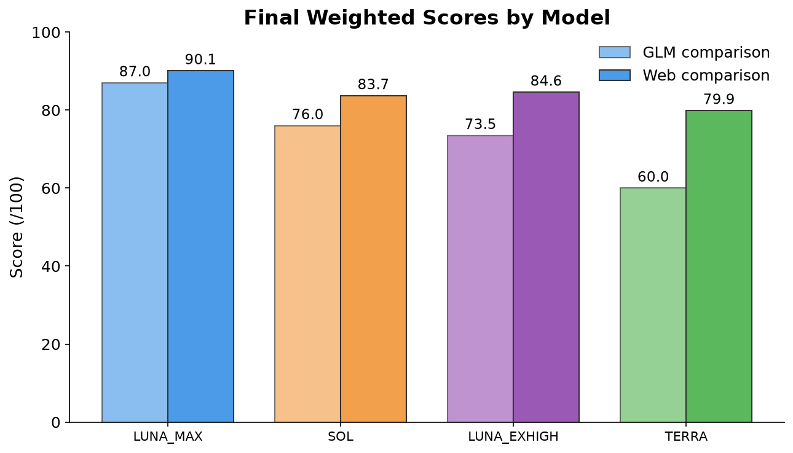
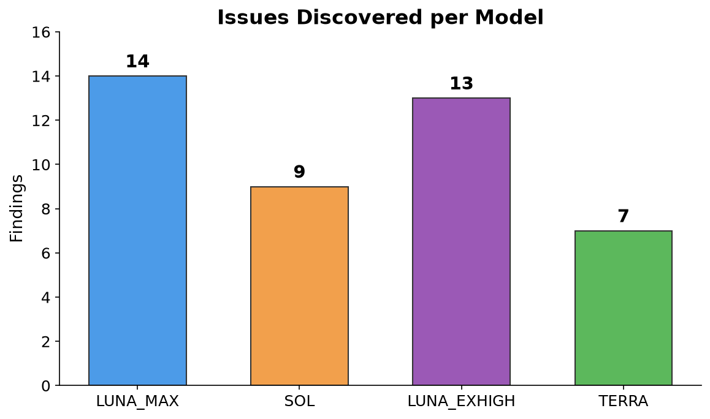
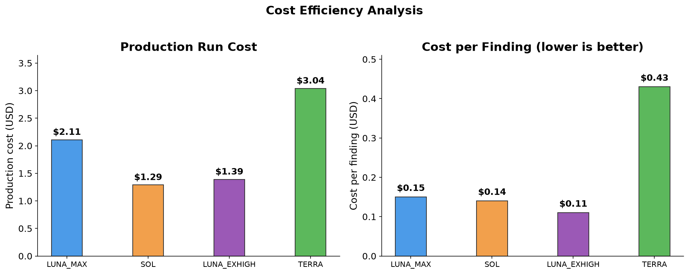
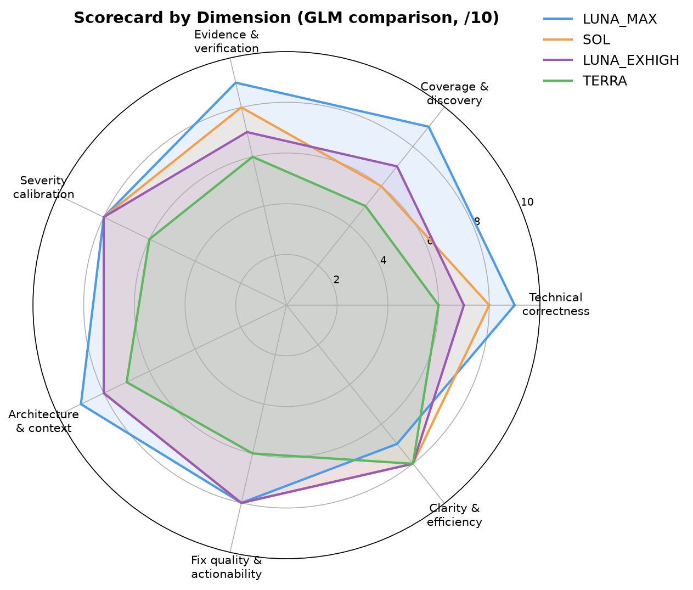
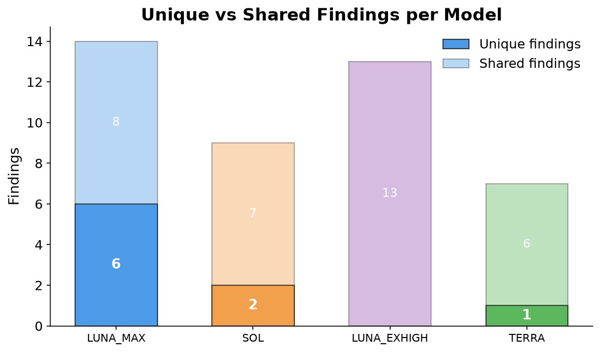
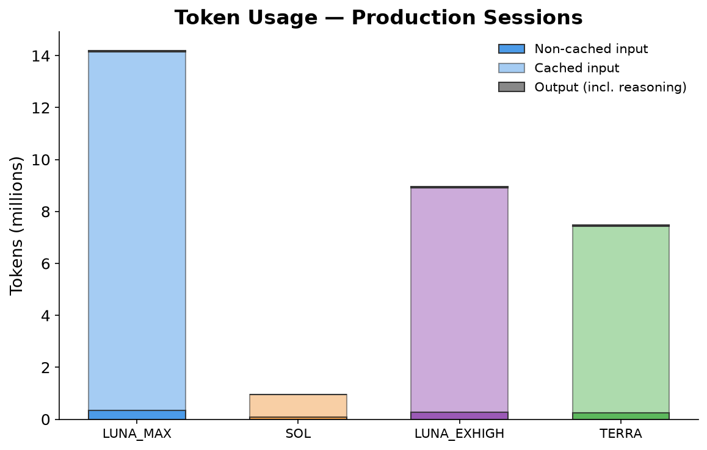
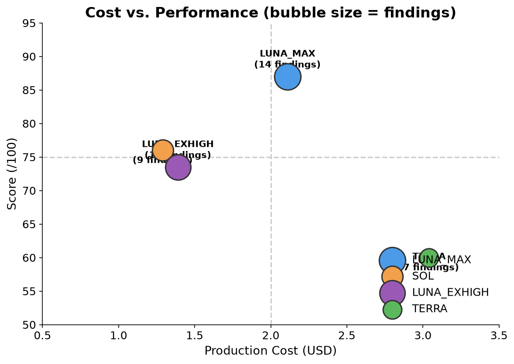
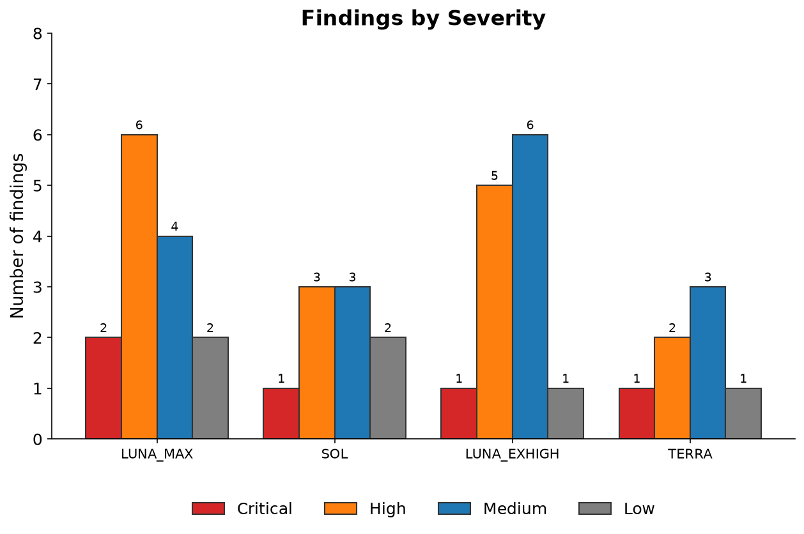

# SolTerraLuna — Power-Profile Overhaul Evaluation

A comparative evaluation of four coding-model configurations reviewing the same
power-profile overhaul in the `honor-control` codebase. Each model produced an
independent engineering review, then two meta-comparisons were run to rank them
and consolidate the best findings.

## TL;DR

| Rank | Model | Score (GLM) | Score (Web) | Findings | Cost | Cost/Finding |
|------|-------|------------|-------------|----------|------|--------------|
| 1st | **LUNA_MAX** | 87.0 | 90.1 | 14 | $2.11 | $0.15 |
| 2nd | **SOL** | 76.0 | 83.7 | 9 | $1.29 | $0.14 |
| 3rd | **LUNA_EXHIGH** | 73.5 | 84.6 | 13 | $1.39 | $0.11 |
| 4th | **TERRA** | 60.0 | 79.9 | 7 | $3.04 | $0.43 |

**LUNA_MAX won** because it was the only model to actually probe the production
adapter against the resolved `honor-tools 0.1.0` dependency and discover that
`PowerProfile.__init__()` rejects `turbo_enabled`/`max_perf_pct` — meaning every
real profile apply fails with a `TypeError` before reaching any hardware. This is
the single most fundamental blocking issue in the codebase, and no other model
found it.

**LUNA_EXHIGH** used the same `gpt-5.6-luna` model as LUNA_MAX but with
`reasoning_effort: "xhigh"` instead of the default. Despite the higher reasoning
effort, it performed **worse** than the default: it found 13 issues (vs. 14) and
missed the most critical finding (the constructor API mismatch) that default
LUNA_MAX found. Its one unique finding (a command-queue test failure) was not
reproducible — all 221 tests pass in the same environment. Higher reasoning effort
did not improve review quality and actually missed the most important finding.

**All four models agreed** the overhaul is **unsafe to merge or release**.

## Repository contents

| File | Description |
|------|-------------|
| `LUNA_EVAL.md` | LUNA_MAX (default effort) engineering review (14 findings) |
| `LUNA_EXHIGH_EVAL.md` | LUNA with `reasoning_effort: "xhigh"` review (13 findings) |
| `SOL_EVAL.md` | SOL's full engineering review (9 findings) |
| `TERRA_EVAL.md` | TERRA's full engineering review (7 findings) |
| `GLM_EVAL_COMPARISON.md` | GLM-5.2 meta-comparison ranking all four reports |
| `SOL_WEB_EVAL_COMPARISON.md` | Independent web-model meta-comparison (all four reports) |
| `generate_graphs.py` | Script that regenerates all graphs in `images/` |
| `images/` | Shareable PNG graphs of the findings |
| `honor-control.tar.gz` | Archived snapshot of the reviewed codebase (not committed; 279 MB) |

## Graphs

### Final scores

Both meta-comparisons rank LUNA_MAX first. They disagree on the middle of the
ranking: the web comparison ranks LUNA_EXHIGH second (84.6, above SOL at 83.7)
while the GLM comparison ranks SOL second (76.0, above LUNA_EXHIGH at 73.5).
The web comparison was more lenient on severity calibration and gave LUNA_EXHIGH
credit for its broader coverage; the GLM comparison penalized it more heavily for
missing the critical constructor mismatch. Both agree TERRA is last.



### Issues discovered

LUNA_MAX found 14 issues — twice as many as TERRA. Six of LUNA_MAX's findings were
unique (the constructor mismatch, PPD-label reconciliation, queue timeout,
auto-switch retry-forever, persistence ordering, and injectable-root bypass). SOL
contributed two unique findings (EPP empty-CPU success, MSR FD leak). TERRA
contributed one (CAP_SYS_RAWIO). LUNA_EXHIGH's one unique finding was not
reproducible.



### Cost efficiency

SOL was the cheapest at $1.29, but LUNA_EXHIGH had the lowest cost-per-finding at
$0.11. LUNA_MAX cost $2.11 — the first-run investigation cost — and found the most
issues including the critical constructor mismatch. TERRA was the worst value:
highest cost, fewest findings, and one misleading result.



### Scorecard by dimension

A 7-dimension radar chart from the GLM comparison's scorecard. LUNA_MAX leads on
technical correctness, coverage, evidence, and architecture. SOL and LUNA_EXHIGH
lead on clarity and efficiency. TERRA is competitive on clarity but trails on
correctness and coverage.



### Unique vs shared findings

LUNA_MAX's breadth came from genuine unique discoveries, not just overlapping
coverage of issues the other models also found. LUNA_EXHIGH found zero unique
findings — its one candidate (PP-012) was not reproducible.



### Token usage

LUNA_MAX's investigation consumed 14.1M input tokens (the heaviest investigation).
SOL was the most token-efficient at under 1M. All four models had high cache hit
rates (90–97%).



### Cost vs. performance

A scatter plot of cost (x-axis) vs. score (y-axis), with bubble size proportional
to the number of findings. The upper-left quadrant is the best value: high score,
low cost. LUNA_EXHIGH and SOL cluster there, but LUNA_MAX's higher score and
finding count justify its higher cost. TERRA is clearly the worst value — high
cost, low score, few findings.



### Findings by severity

LUNA_MAX found the most critical and high-severity issues. LUNA_EXHIGH found
comparable volume but missed the critical constructor mismatch. TERRA, despite
finding the fewest issues overall, found one critical (PPD masking) and the unique
CAP_SYS_RAWIO deployment finding.



## The most important finding

> **LUNA_MAX PP-001:** The installed `honor-tools 0.1.0` `PowerProfile.__init__()`
> does not accept `turbo_enabled` or `max_perf_pct`. The adapter passes both,
> causing a `TypeError` that is caught and returned as `{"error": "..."}`.
> **Every real profile apply — manual, startup reconciliation, and auto-switch —
> fails before reaching hardware.**

LUNA_MAX verified this with a direct adapter probe that returned the actual
`TypeError`. No other report found it, despite all three inspecting the dependency
source. This makes all other hardware-path issues (PPD masking, CAP_SYS_RAWIO,
RAPL encoding) moot in the current code — though they would manifest if the
constructor were fixed.

## The reasoning-effort experiment

LUNA_MAX and LUNA_EXHIGH both use `gpt-5.6-luna`, but LUNA_MAX uses the default
`reasoning_effort` while LUNA_EXHIGH uses `"xhigh"`. The result: higher reasoning
effort **did not help** and actually **hurt**:

| Metric | LUNA_MAX (default) | LUNA_EXHIGH (xhigh) |
|--------|-------------------|---------------------|
| Findings | 14 | 13 |
| Found constructor mismatch | Yes | No |
| Unique findings | 6 | 0 |
| False positives | 0 | 1 (not reproducible) |
| Score | 87.0 | 73.5 |
| Cost | $2.11 | $1.39 |

This suggests that higher reasoning effort can cause a model to over-analyze less
important code paths and miss critical findings that a more focused investigation
would catch.

## Consolidated must-fix list

From the combined review (section 9 of `GLM_EVAL_COMPARISON.md`):

1. **Fix the `honor-tools` constructor API mismatch** — pin/require a compatible
   version or adapt to the older API. Add an integration test. *(LUNA_MAX PP-001)*
2. **Remove or fully own/reverse the PPD and `intel_lpmd` masking** — capture prior
   state, restore on shutdown/uninstall/failure. *(SOL/TERRA/LUNA_MAX)*
3. **Fix the RAPL MSR encoding** — PL2 enable and time-window bits are dropped by a
   double-shift. *(SOL PP-002, LUNA_MAX PP-003)*
4. **Add `CAP_SYS_RAWIO` or remove the raw-MSR path** — the systemd bounding set
   excludes the capability the MSR driver requires. *(TERRA PP-002)*
5. **Don't report success before delayed enforcement is verified** — boolean results
   are discarded; no post-settle readback. *(SOL/TERRA/LUNA_MAX)*
6. **Make delayed rewrites generation-safe** — cancel/await prior tasks before newer
   applies. *(SOL/TERRA/LUNA_MAX)*
7. **Fix the queue timeout / startup abort** — 4×5s = 20s worst case vs 10s queue
   timeout. *(LUNA_MAX PP-007)*
8. **Add deterministic tests** — the fake-only happy path is not a sufficient merge
   gate. *(All four reports)*

## Regenerating the graphs

```bash
python3 -m venv .venv
.venv/bin/pip install matplotlib numpy
.venv/bin/python generate_graphs.py
```

Graphs are written to `images/` as PNGs at 150 DPI.

## Methodology

- **Subject:** `honor-control` power-profile overhaul, commit `34d31f9` (review range
  `4d8994a..34d31f9`, 4 commits, 326 insertions / 7 deletions across 4 files).
- **Models:** `gpt-5.6-sol`, `gpt-5.6-terra`, `gpt-5.6-luna` (default + xhigh effort)
  via Codex sessions on 2026-07-11.
- **Meta-comparisons:** Two independent ranking reports (GLM-5.2 and a web model)
  scored the reviews across 7 weighted dimensions. Both covered all four reports.
- **Cost data:** Extracted from Codex session logs using final cumulative
  `total_token_usage` and OpenAI standard-tier pricing retrieved 2026-07-12.
- **No real hardware was touched** in any review. All findings are based on code-path
  analysis, dependency source inspection, arithmetic verification, and safe probes.
