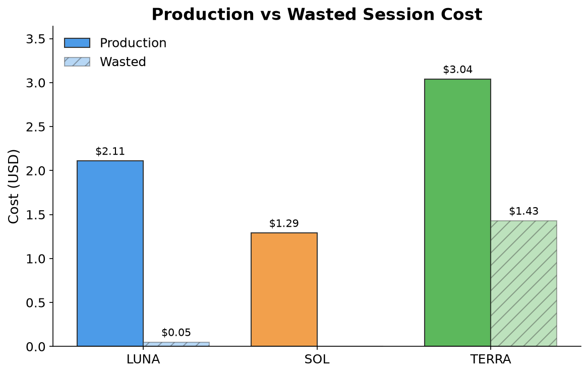

# SolTerraLuna — Power-Profile Overhaul Evaluation

A comparative evaluation of three frontier coding models (**SOL**, **TERRA**, **LUNA**)
reviewing the same power-profile overhaul in the `honor-control` codebase. Each model
produced an independent engineering review, then two meta-comparisons were run to rank
them and consolidate the best findings.

## TL;DR

| Rank | Model | Score (GLM) | Score (Web) | Findings | Cost | Cost/Finding |
|------|-------|------------|-------------|----------|------|--------------|
| 1st | **LUNA** | 87.0 | 90.1 | 14 | $2.11 | $0.15 |
| 2nd | **SOL** | 76.0 | 83.7 | 9 | $1.29 | $0.14 |
| 3rd | **TERRA** | 60.0 | 79.9 | 7 | $3.04 | $0.43 |

**LUNA won** because it was the only model to actually probe the production adapter
against the resolved `honor-tools 0.1.0` dependency and discover that
`PowerProfile.__init__()` rejects `turbo_enabled`/`max_perf_pct` — meaning every real
profile apply fails with a `TypeError` before reaching any hardware. This is the single
most fundamental blocking issue in the codebase, and neither SOL nor TERRA found it.

**All three models agreed** the overhaul is **unsafe to merge or release**.

## Repository contents

| File | Description |
|------|-------------|
| `LUNA_EVAL.md` | LUNA's full engineering review (14 findings) |
| `SOL_EVAL.md` | SOL's full engineering review (9 findings) |
| `TERRA_EVAL.md` | TERRA's full engineering review (7 findings) |
| `GLM_EVAL_COMPARISON.md` | GLM-5.2 meta-comparison ranking the three reports |
| `SOL_WEB_EVAL_COMPARISON.md` | Independent web-model meta-comparison |
| `generate_graphs.py` | Script that regenerates all graphs in `images/` |
| `images/` | Shareable PNG graphs of the findings |
| `honor-control.tar.gz` | Archived snapshot of the reviewed codebase (not committed; 279 MB — see below) |

## Graphs

### Final scores

Both meta-comparisons rank LUNA first, SOL second, TERRA third. The web comparison
scores are uniformly higher (it was more lenient on severity calibration), but the
ranking is identical.


### Issues discovered

LUNA found 14 issues — twice as many as TERRA. Six of LUNA's findings were unique
(the constructor mismatch, PPD-label reconciliation, queue timeout, auto-switch
retry-forever, persistence ordering, and injectable-root bypass). SOL contributed two
unique findings (EPP empty-CPU success, MSR FD leak). TERRA contributed one
(CAP_SYS_RAWIO).


### Cost efficiency

LUNA's production cost is counted as the **first-run investigation cost of $2.11**,
not the $1.20 re-run. The re-run only succeeded because it reused cached context from
the $2.11 run that did the real investigation — counting only the re-run would
understate LUNA's true cost. Even at $2.11, LUNA delivered the most findings per
dollar. TERRA was the worst value: highest cost, fewest findings, and one misleading
result.


### Scorecard by dimension

A 7-dimension radar chart from the GLM comparison's scorecard. LUNA leads on
technical correctness, coverage, evidence, and architecture. SOL leads on clarity
and efficiency. TERRA is competitive on clarity but trails on correctness and
coverage.


### Unique vs shared findings

LUNA's breadth came from genuine unique discoveries, not just overlapping coverage
of issues the other models also found.


### Token usage

LUNA's first run consumed 14.1M input tokens (the heaviest investigation). SOL was
the most token-efficient at under 1M. All three models had high cache hit rates
(90–97%).


### Wasted vs production cost

The user's workflow had $3.57 of wasted sessions from forgetting to move previous
eval files out before starting the next model, or from prompt template errors. LUNA's
$2.11 first run is counted as production (the real investigation); only the two tiny
file-management sessions ($0.03 + $0.02) remain as wasted.



### Findings by severity

LUNA found the most critical and high-severity issues. TERRA, despite finding the
fewest issues overall, found one critical (PPD masking) and the unique CAP_SYS_RAWIO
deployment finding.


## The most important finding

> **LUNA PP-001:** The installed `honor-tools 0.1.0` `PowerProfile.__init__()` does
> not accept `turbo_enabled` or `max_perf_pct`. The adapter passes both, causing a
> `TypeError` that is caught and returned as `{"error": "..."}`. **Every real profile
> apply — manual, startup reconciliation, and auto-switch — fails before reaching
> hardware.**

LUNA verified this with a direct adapter probe that returned the actual `TypeError`.
No other report found it, despite both SOL and TERRA inspecting the dependency source.
This makes all other hardware-path issues (PPD masking, CAP_SYS_RAWIO, RAPL encoding)
moot in the current code — though they would manifest if the constructor were fixed.

## Consolidated must-fix list

From the combined review (section 9 of `GLM_EVAL_COMPARISON.md`):

1. **Fix the `honor-tools` constructor API mismatch** — pin/require a compatible
   version or adapt to the older API. Add an integration test. *(LUNA PP-001)*
2. **Remove or fully own/reverse the PPD and `intel_lpmd` masking** — capture prior
   state, restore on shutdown/uninstall/failure. *(SOL/TERRA/LUNA)*
3. **Fix the RAPL MSR encoding** — PL2 enable and time-window bits are dropped by a
   double-shift. *(SOL PP-002, LUNA PP-003)*
4. **Add `CAP_SYS_RAWIO` or remove the raw-MSR path** — the systemd bounding set
   excludes the capability the MSR driver requires. *(TERRA PP-002)*
5. **Don't report success before delayed enforcement is verified** — boolean results
   are discarded; no post-settle readback. *(SOL/TERRA/LUNA)*
6. **Make delayed rewrites generation-safe** — cancel/await prior tasks before newer
   applies. *(SOL/TERRA/LUNA)*
7. **Fix the queue timeout / startup abort** — 4×5s = 20s worst case vs 10s queue
   timeout. *(LUNA PP-007)*
8. **Add deterministic tests** — the fake-only happy path is not a sufficient merge
   gate. *(All three reports)*

## Regenerating the graphs

```bash
python3 -m venv .venv
.venv/bin/pip install matplotlib numpy
.venv/bin/python generate_graphs.py
```

Graphs are written to `images/` as PNGs at 150 DPI.

## Methodology

- **Subject:** `honor-control` power-profile overhaul, commit `34d31f9` (review range
  `4d8994a..34d31f9`, 4 commits, 326 insertions / 7 deletions across 4 files).
- **Models:** `gpt-5.6-sol`, `gpt-5.6-terra`, `gpt-5.6-luna` (via Codex sessions on
  2026-07-11).
- **Meta-comparisons:** Two independent ranking reports (GLM-5.2 and a web model)
  scored the three reviews across 7 weighted dimensions.
- **Cost data:** Extracted from Codex session logs using final cumulative
  `total_token_usage` and OpenAI standard-tier pricing retrieved 2026-07-12.
- **No real hardware was touched** in any review. All findings are based on code-path
  analysis, dependency source inspection, arithmetic verification, and safe probes.
