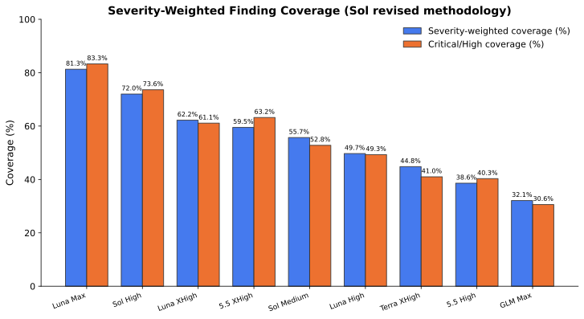
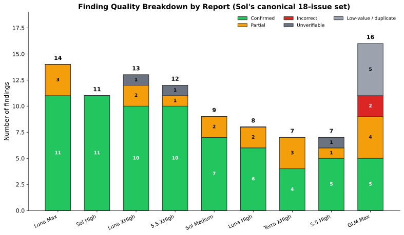
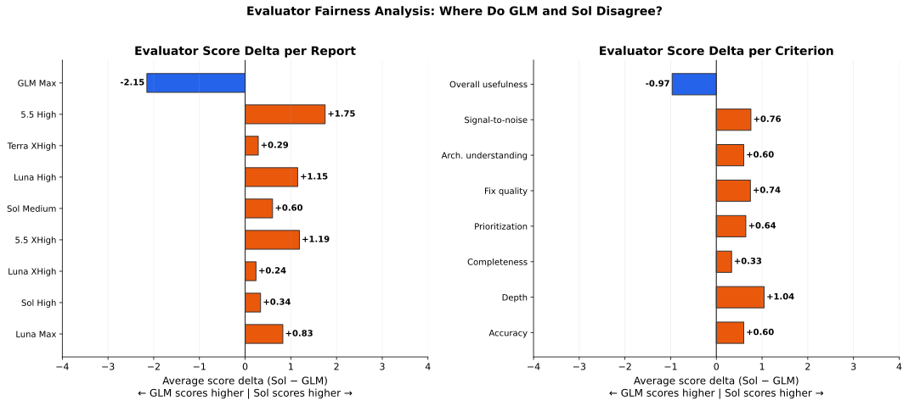
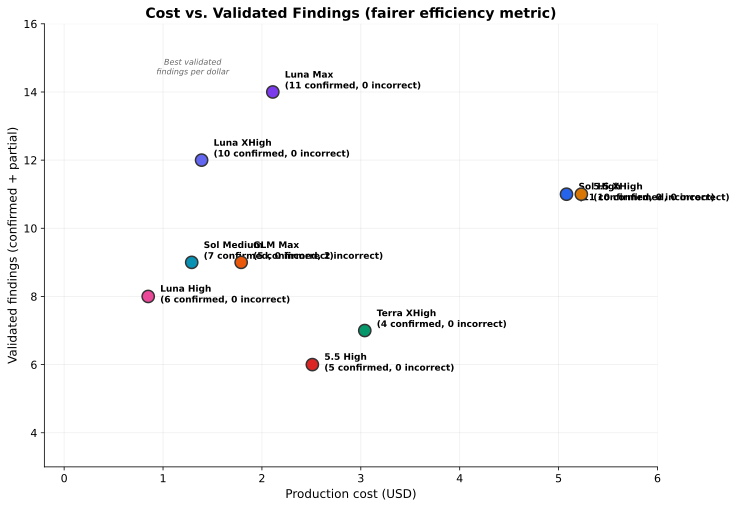

# SolTerraLuna — Power-Profile Overhaul Model Evaluation

A comparative evaluation of **nine AI model configurations** that independently
reviewed the same power-profile overhaul in the `honor-control` codebase. Two
independent meta-evaluators — **GLM-5.2** and **GPT-5.6-Sol High** (with web
access) — then audited all nine reports to reduce single-model bias.

## TL;DR

| Rank | Report | Model | Effort | Cost | GLM rank | Sol rank | Key strength |
|------|--------|-------|--------|------|----------|----------|--------------|
| 1 | **LUNA Max** | GPT-5.6-Luna | max | $2.11 | 2 | 1 | Highest severity-weighted coverage; only report to find the Critical dependency API break |
| 2 | **SOL High** | GPT-5.6-Sol | high | $5.08 | 1 | 2 | Most accurate report; caught CAP_SYS_RAWIO and sticky applied-state overlay |
| 3 | **LUNA XHigh** | GPT-5.6-Luna | xhigh | $1.39 | 5 | 3 | Broad, mostly validated coverage across eleven issue areas |
| 4 | **5.5 XHigh** | GPT-5.5 | xhigh | $5.23 | 7 | 4 | Excellent core blocker coverage; ten confirmed findings |
| 5 | **SOL Medium** | GPT-5.6-Sol | medium | $1.29 | 4 | 5 | Disciplined, practical, strong validated density; best value |
| 6 | **LUNA High** | GPT-5.6-Luna | high | $0.85 | 8 | 6 | Useful and technically sound, but misses two key blockers |
| 7 | **TERRA XHigh** | GPT-5.6-Terra | xhigh | $3.04 | 6 | 7 | Valuable CAP_SYS_RAWIO finding, but misses Critical PL2 bug |
| 8 | **5.5 High** | GPT-5.5 | high | $2.51 | 9 | 8 | Correct on main source bugs but narrow and understates severity |
| 9 | **GLM Max** | GLM-5.2 | max | $1.79 | 3 | 9 | High apparent volume but low validated density; two incorrect High-severity claims |

**The evaluators disagree on #1:** GLM ranks SOL High first; Sol's revised
methodology ranks LUNA Max first, because LUNA Max was the only report to
discover the Critical `honor-tools` dependency API incompatibility. Both agree
the overhaul is **unsafe to merge or release**.

**The primary disagreement** about GLM Max (ranked 3rd by GLM, 9th by Sol) was
resolved by independent verification: `systemctl mask` is a D-Bus operation
handled by PID 1, confirming Sol is correct that `ProtectSystem=strict` does not
block it. GLM Max's PP-003 and PP-004 are incorrect.

**Best value:** SOL Medium ($1.29) identified key issues that several higher-cost
reports missed.

## Key graphs

### Overall scores by evaluator


### Severity-weighted finding coverage (Sol revised methodology)



### Finding quality breakdown



### Evaluator fairness analysis



### Cost vs. validated findings



### Ranking differences between evaluators


More graphs are in the [full report](MODELS_EVAL_SUMMARY.md) and the
`docs/assets/` directory (14 SVG files total).

## Repository contents

| File | Description |
|------|-------------|
| `MODELS_EVAL_SUMMARY.md` | **Combined report** reconciling both meta-evaluations |
| `GLM_MODELS_EVAL.md` | Meta-evaluation by GLM-5.2 (no web access) |
| `SOL_WEB_HIGH_MODELS_EVAL.md` | Meta-evaluation by GPT-5.6-Sol High (with web access, revised) |
| `5.5_HIGH_EVAL.md` | GPT-5.5 high-effort code review (7 findings) |
| `5.5_XHIGH_EVAL.md` | GPT-5.5 xhigh-effort code review (12 findings) |
| `GLM_MAX_EVAL.md` | GLM-5.2 max-effort code review (16 findings) |
| `LUNA_HIGH_EVAL.md` | GPT-5.6-Luna high-effort code review (8 findings) |
| `LUNA_MAX_EVAL.md` | GPT-5.6-Luna max-effort code review (14 findings) |
| `LUNA_XHIGH_EVAL.md` | GPT-5.6-Luna xhigh-effort code review (13 findings) |
| `SOL_HIGH_EVAL.md` | GPT-5.6-Sol high-effort code review (11 findings) |
| `SOL_MEDIUM_EVAL.md` | GPT-5.6-Sol medium-effort code review (9 findings) |
| `TERRA_XHIGH_EVAL.md` | GPT-5.6-Terra xhigh-effort code review (7 findings) |
| `generate_graphs.py` | Script that regenerates all graphs from `docs/evaluation/eval_data.json` |
| `docs/evaluation/eval_data.json` | Normalized data (scores, costs, rankings, issue coverage, severity-weighted coverage) |
| `docs/assets/` | SVG graphs (14 files) |
| `honor-control.tar.gz` | Archived snapshot of the reviewed codebase (not committed; 279 MB) |

## Regenerating the graphs

```bash
pip install matplotlib numpy
python3 generate_graphs.py
```

Graphs are written to `docs/assets/` as SVG files. The script reads all data from
`docs/evaluation/eval_data.json`, so graphs and tables are fully reproducible from
the normalized data.

## Methodology

- **Subject:** `honor-control` power-profile overhaul, commit `34d31f9` (review range
  `4d8994a..34d31f9`, 4 commits, 326 insertions / 7 deletions across 4 files).
- **Models evaluated:** Nine configurations across 5 models (GPT-5.5, GPT-5.6-Luna,
  GPT-5.6-Sol, GPT-5.6-Terra, GLM-5.2) at medium/high/xhigh/max effort levels.
- **Meta-evaluators:** Two independent evaluations (GLM-5.2 without web access,
  GPT-5.6-Sol High with web access) scored all nine reports across 8 criteria.
  Sol's revised methodology weights severity-weighted finding coverage at 60% of
  the overall score.
- **Cost data:** Extracted from Codex session logs and opencode database using
  official API pricing. Total evaluation cost: $23.29.
- **No real hardware was touched** in any review. All findings are based on
  code-path analysis, dependency source inspection, arithmetic verification, and
  safe probes.

For the complete analysis including disagreements, confidence levels, and
per-workload recommendations, see the [full combined report](MODELS_EVAL_SUMMARY.md).
